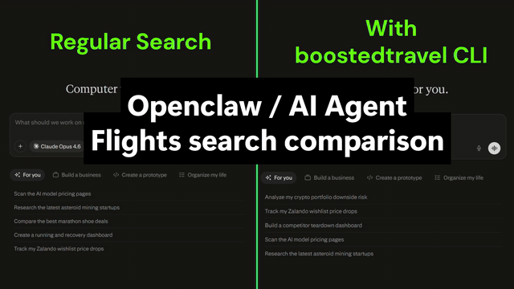

<div align="center">


# Your AI agent just learned to book flights.

**195 airlines. Real prices. One function call.**

LetsFG gives your AI agent flight search and booking superpowers — 195 airline connectors fire in parallel, enterprise GDS sources (Amadeus, Sabre, Duffel) fill in the rest, and your agent gets the cheapest price on the planet. Zero markup. Real airline tickets.

**The same flight costs $20–$50 less** because you skip OTA inflation, cookie tracking, and surge pricing.

<br>

[](https://github.com/LetsFG/LetsFG)
&nbsp;&nbsp;
[](https://m.me/61579557368989)
&nbsp;&nbsp;
[](https://pypi.org/project/letsfg/)

<br>

[](https://github.com/LetsFG/LetsFG)
[](https://pypi.org/project/letsfg/)
[](https://www.npmjs.com/package/letsfg-mcp)
[](https://smithery.ai/servers/letsfg)
[](LICENSE)

</div>

---

## See it in action

<div align="center">
  
  <br><br>
  <em>Default agent search vs LetsFG. Same query — LetsFG finds cheaper flights across 195 airlines in seconds.</em>
</div>

---

## Try it right now — no install needed

**Don't want to install anything?** Message our AI assistant on Messenger and search flights instantly:

<div align="center">

### 👉 [**m.me/letsfg** — Try it on Messenger](https://m.me/61579557368989) 👈

</div>

Ask it anything: *"Find me the cheapest flight from London to Barcelona next month"* — it searches 195 airlines in real time and gives you the best deals.

When you're ready to integrate it into your own agent, keep reading.

---

## Why developers star this repo

| | Google Flights / Expedia | **LetsFG** |
|---|---|---|
| Price | Inflated (tracking, cookies, surge) | **Raw airline price. Zero markup.** |
| Coverage | Misses budget airlines | **195 connectors + 400 GDS airlines** |
| Speed | 30s+ (loading, ads, redirects) | **~10 seconds** |
| Repeat search raises price? | Yes | **Never** |
| Works in AI agents? | No | **Native** (CLI, MCP, SDK) |
| Booking | Redirects to OTA checkout | **Real airline PNR, e-ticket to inbox** |
| Cost to you | Hidden markup | **Free search. Ticket price only for booking.** |

---

## Get started in 30 seconds

```bash
pip install letsfg
```

Search flights immediately — no account, no API key:

```bash
letsfg search-local LHR BCN 2026-06-15
```

That single command fires 195 airline connectors on your machine and returns real-time prices. **Free. Unlimited. Zero setup.**

Want enterprise GDS coverage too? One more command:

```bash
letsfg register --name my-agent --email you@example.com
export LETSFG_API_KEY=trav_...
letsfg search LHR JFK 2026-04-15
```

<details>
<summary><strong>Full search → unlock → book flow</strong></summary>

```bash
# Search (free, unlimited)
letsfg search LON BCN 2026-04-01 --return 2026-04-08 --sort price

# Unlock (confirms live price, holds for 30 min — free)
letsfg unlock off_xxx

# Book (ticket price only, zero markup)
letsfg book off_xxx \
  --passenger '{"id":"pas_0","given_name":"John","family_name":"Doe","born_on":"1990-01-15","gender":"m","title":"mr"}' \
  --email john.doe@example.com
```

</details>

> ⭐ **Star this repo → register → get unlimited access forever.** No trial, no catch. First 1,000 stars only.

---

## Works everywhere your agent runs

### MCP Server (Claude Desktop / Cursor / Windsurf / OpenClaw)

```json
{
  "mcpServers": {
    "letsfg": {
      "command": "npx",
      "args": ["-y", "letsfg-mcp"]
    }
  }
}
```

**That's it — search works immediately, no API key needed.** 195 airline connectors run locally.

<details>
<summary>Add API key for unlock/book + GDS coverage</summary>

```json
{
  "mcpServers": {
    "letsfg": {
      "command": "npx",
      "args": ["-y", "letsfg-mcp"],
      "env": {
        "LETSFG_API_KEY": "trav_your_api_key"
      }
    }
  }
}
```

Get a key: `letsfg register --name my-agent --email you@example.com`

</details>

**5-minute quickstarts:** [Claude Desktop](docs/quickstart-claude.md) · [Cursor](docs/quickstart-cursor.md) · [Windsurf](docs/quickstart-windsurf.md)

### Python SDK

```python
from letsfg import LetsFG

bt = LetsFG()  # reads LETSFG_API_KEY from env
flights = bt.search("LHR", "JFK", "2026-04-15")
print(f"{flights.total_results} offers, cheapest: {flights.cheapest.summary()}")
```

### JavaScript SDK

```typescript
import { LetsFG } from 'letsfg';

const bt = new LetsFG({ apiKey: 'trav_...' });
const flights = await bt.search('LHR', 'JFK', '2026-04-15');
console.log(`${flights.totalResults} offers`);
```

### Local-only (no API key, no backend)

```python
from letsfg.local import search_local

result = await search_local("GDN", "BCN", "2026-06-15")
for offer in result.offers[:5]:
    print(f"{offer.airlines[0]}: {offer.currency} {offer.price}")
```

---

## Install

| Package | Command | What you get |
|---------|---------|--------------|
| **Python SDK + CLI** | `pip install letsfg` | SDK + CLI + 195 local airline connectors |
| **MCP Server** | `npx letsfg-mcp` | Claude, Cursor, Windsurf — no API key needed |
| **JS/TS SDK** | `npm install -g letsfg` | SDK + CLI |
| **Remote MCP** | `https://api.letsfg.co/mcp` | No install (API key required) |
| **Smithery** | [smithery.ai/servers/letsfg](https://smithery.ai/servers/letsfg) | One-click MCP install |

---

## CLI Commands

| Command | Description |
|---------|-------------|
| `letsfg search <origin> <dest> <date>` | Search flights (free) |
| `letsfg search-local <origin> <dest> <date>` | Search locally, no API key |
| `letsfg register` | Get your API key |
| `letsfg locations <query>` | Resolve city/airport to IATA codes |
| `letsfg unlock <offer_id>` | Confirm live price & reserve 30 min |
| `letsfg book <offer_id>` | Book the flight |
| `letsfg me` | View profile & usage stats |

All commands accept `--json` for structured output and `--api-key` to override the env variable.

---

## How it works

```
Search (free) → Unlock (free) → Book (ticket price only)
```

1. **Search** — 195 local connectors + enterprise GDS sources fire in parallel. Returns full details: price, airlines, duration, stopovers, conditions.
2. **Unlock** — confirms the live price with the airline and reserves the fare for 30 minutes.
3. **Book** — creates a real airline PNR. E-ticket sent to the passenger's inbox.

### Two search channels run simultaneously

| Channel | What it does | Speed | Auth |
|---------|-------------|-------|------|
| **Local connectors** | 195 airline scrapers on your machine via Playwright + httpx | 5-25s | None |
| **Cloud GDS/NDC** | Amadeus, Duffel, Sabre, Travelport, Kiwi via backend API | 2-15s | API key |

Results are merged, deduplicated, currency-normalized, and sorted. Best price wins.

<details>
<summary><strong>Virtual interlining</strong></summary>

The combo engine builds cross-airline round-trips by combining one-way fares from different carriers. A Ryanair outbound + Wizz Air return can save 30-50% vs booking a round-trip on either airline alone.

</details>

<details>
<summary><strong>City-wide airport expansion</strong></summary>

Search a city code and LetsFG automatically searches all airports in that city. `LON` expands to LHR, LGW, STN, LTN, SEN, LCY. `NYC` expands to JFK, EWR, LGA. Works for 25+ major cities worldwide.

</details>

---

## Architecture

```
┌─────────────────────────────────────────────────────┐
│  AI Agents / CLI / SDK / MCP Server                 │
├──────────────────┬──────────────────────────────────┤
│  Local connectors │  Enterprise Cloud API            │
│  (195 airlines via│  (Amadeus, Duffel, Sabre,        │
│   Playwright)     │   Travelport, Kiwi — contract-   │
│                   │   only GDS/NDC providers)        │
├──────────────────┴──────────────────────────────────┤
│            Merge + Dedup + Combo Engine              │
│            (virtual interlining, currency norm)      │
└─────────────────────────────────────────────────────┘
```

<details>
<summary><strong>195 airline connectors — full list</strong></summary>

| Region | Airlines |
|--------|----------|
| **Europe** | Ryanair, Wizz Air, EasyJet, Norwegian, Vueling, Eurowings, Transavia, Pegasus, Turkish Airlines, Condor, SunExpress, Volotea, Smartwings, Jet2, LOT Polish Airlines, Finnair, SAS, Aegean, Aer Lingus, ITA Airways, TAP Portugal, Icelandair, PLAY |
| **Middle East & Africa** | Emirates, Etihad, Qatar Airways, flydubai, Air Arabia, flynas, Salam Air, Air Peace, FlySafair, EgyptAir, Ethiopian Airlines, Kenya Airways, Royal Air Maroc, South African Airways |
| **Asia-Pacific** | AirAsia, IndiGo, SpiceJet, Akasa Air, Air India, Air India Express, VietJet, Cebu Pacific, Scoot, Jetstar, Peach, Spring Airlines, Lucky Air, 9 Air, Nok Air, Batik Air, Jeju Air, T'way Air, ZIPAIR, Singapore Airlines, Cathay Pacific, Malaysian Airlines, Thai Airways, Korean Air, ANA, JAL, Qantas, Virgin Australia, Bangkok Airways, Air New Zealand, Garuda Indonesia, Philippine Airlines, US-Bangla, Biman Bangladesh |
| **Americas** | American Airlines, Delta, United, Southwest, JetBlue, Alaska Airlines, Hawaiian Airlines, Sun Country, Frontier, Volaris, VivaAerobus, Allegiant, Avelo, Breeze, Flair, GOL, Azul, JetSmart, Flybondi, Porter, WestJet, LATAM, Copa, Avianca, Air Canada, Arajet, Wingo, Sky Airline |
| **Aggregator** | Kiwi.com (virtual interlining + LCC fallback) |

Each connector uses one of three strategies:

| Strategy | How it works | Example airlines |
|----------|-------------|-----------------|
| **Direct API** | Reverse-engineered REST/GraphQL endpoints via `httpx`/`curl_cffi` | Ryanair, Wizz Air, Norwegian, Akasa |
| **CDP Chrome** | Real Chrome + Playwright CDP for sites with bot detection | EasyJet, Southwest, Pegasus |
| **API Interception** | Playwright page navigation + response interception | VietJet, Cebu Pacific, Lion Air |

</details>

<details>
<summary><strong>Performance tuning — browser concurrency</strong></summary>

LetsFG auto-detects your system's available RAM and scales browser concurrency accordingly:

| System RAM | Tier | Max Browsers |
|-----------|------|-------------|
| < 2 GB | Minimal | 2 |
| 2–4 GB | Low | 3 |
| 4–8 GB | Moderate | 5 |
| 8–16 GB | Standard | 8 |
| 16–32 GB | High | 12 |
| 32+ GB | Maximum | 16 |

Override auto-detection:

```bash
export LETSFG_MAX_BROWSERS=4              # env var
letsfg search-local LHR BCN --max-browsers 4  # CLI flag
letsfg system-info                         # check your tier
```

</details>

---

## Error Handling

| Exception | HTTP | When |
|-----------|------|------|
| `AuthenticationError` | 401 | Missing or invalid API key |
| `OfferExpiredError` | 410 | Offer no longer available (search again) |
| `LetsFGError` | any | Base class for all API errors |

---

## Documentation

| Guide | Description |
|-------|-------------|
| [Getting Started](docs/getting-started.md) | Auth, payment, search flags, cabin classes |
| [API Guide](docs/api-guide.md) | Error handling, search results, unlock details |
| [Agent Guide](docs/agent-guide.md) | AI agent architecture, preference scoring, rate limits |
| [Architecture Guide](docs/architecture-guide.md) | Parallel execution, caching, browser concurrency |
| [Tutorials](docs/tutorials.md) | Python & JS integration tutorials |
| [Self-Hosting](docs/self-hosting.md) | Deploy connectors as local HTTP APIs |
| [CLI Reference](docs/cli-reference.md) | Commands, flags, examples |
| [AGENTS.md](AGENTS.md) | Agent-specific instructions (for LLMs) |

**API docs:** [Swagger UI](https://api.letsfg.co/docs) · [OpenAPI spec](openapi.yaml) · [Smithery](https://smithery.ai/servers/letsfg)

---

<div align="center">

## ⭐ Star this repo to unlock free access

Search is free. Booking costs only the ticket price — zero markup.

Star → register → get unlimited access forever. First 1,000 stars only.

[](https://github.com/LetsFG/LetsFG)
&nbsp;&nbsp;
[](https://m.me/61579557368989)

</div>

---

## Star History

<div align="center">
<a href="https://www.star-history.com/?repos=LetsFG%2FLetsFG&type=date&legend=top-left">
  <picture>
    <source media="(prefers-color-scheme: dark)" srcset="https://api.star-history.com/image?repos=LetsFG/LetsFG&type=date&theme=dark&legend=top-left" />
    <source media="(prefers-color-scheme: light)" srcset="https://api.star-history.com/image?repos=LetsFG/LetsFG&type=date&legend=top-left" />
    
  </picture>
</a>
</div>

---

## Links

- **PyPI:** https://pypi.org/project/letsfg/
- **npm (JS SDK):** https://www.npmjs.com/package/letsfg
- **npm (MCP):** https://www.npmjs.com/package/letsfg-mcp

## Contact & Partnerships

Interested in B2B integration, partnership, or enterprise access? Reach out:

- **General:** contact@letsfg.co
- **Founder:** adam@letsfg.co

## Contributing

See [CONTRIBUTING.md](CONTRIBUTING.md) for guidelines.

## Security

See [SECURITY.md](SECURITY.md) for our security policy.

## License

Free for personal use. Search is free for everyone — no agreement needed. Commercial booking requires a 1% fee (min $1 USD) via Stripe Connect. By using the Software you agree to the [LICENSE](LICENSE). To set up a commercial agreement, email contact@letsfg.co or adam@letsfg.co.

