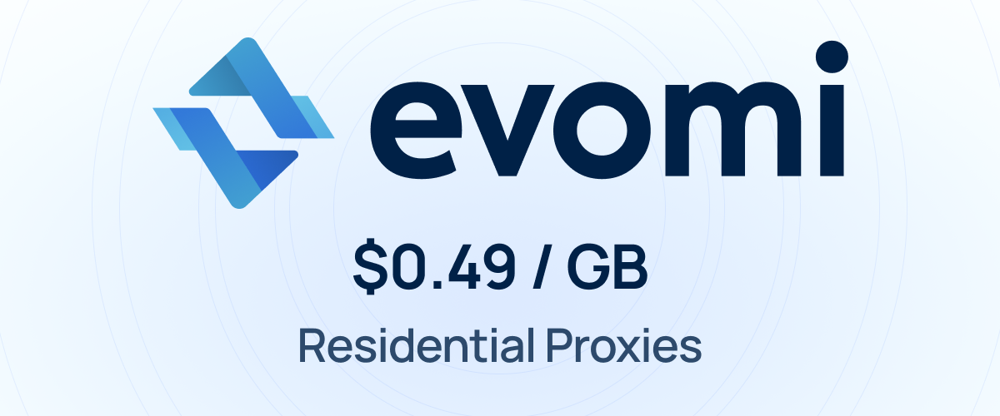

<div align="center">

<a href="https://github.com/LetsFG/LetsFG">
  
</a>

<br>

# We're LetsFG — a community of travelers.

Finding a flight shouldn't mean checking 47 websites. Or 3 hours of searching.<br>
Or having that feeling you could've got a better deal if you'd just waited a little longer.

**So we built something about it.**<br>
No markup. No tracking. No price that goes up because you looked twice.

<br>

[](https://github.com/LetsFG/LetsFG)
&nbsp;&nbsp;
[](https://letsfg.co/en)
&nbsp;&nbsp;
[](https://pypi.org/project/letsfg/)

<br>

[](https://www.instagram.com/letsfg_)
&nbsp;&nbsp;
[](https://www.tiktok.com/@letsfg_)
&nbsp;&nbsp;
[](https://x.com/LetsFG_)

<br>

### Join the community. Help others find cheaper flights. Spread the word.<br>⭐ Star the repo. Share with a friend ✈️

<a href="https://twitter.com/intent/tweet?text=Found%20this.%20200%2B%20airline%20connectors%2C%20real%20prices%2C%20zero%20markup.%20Your%20AI%20agent%20can%20search%20%26%20book%20flights%20now.&url=https%3A%2F%2Fgithub.com%2FLetsFG%2FLetsFG"></a>
&nbsp;
<a href="https://www.linkedin.com/sharing/share-offsite/?url=https%3A%2F%2Fgithub.com%2FLetsFG%2FLetsFG"></a>
&nbsp;
<a href="https://reddit.com/submit?url=https%3A%2F%2Fgithub.com%2FLetsFG%2FLetsFG&title=LetsFG%20-%20200%2B%20airline%20connectors%20for%20AI%20agents.%20Real%20prices%2C%20zero%20markup."></a>
&nbsp;
<a href="https://wa.me/?text=Check%20this%20out!%20LetsFG%20searches%20200%2B%20airlines%20and%20gives%20you%20the%20real%20price.%20No%20markup.%20https%3A%2F%2Fgithub.com%2FLetsFG%2FLetsFG"></a>
&nbsp;
<a href="https://t.me/share/url?url=https%3A%2F%2Fgithub.com%2FLetsFG%2FLetsFG&text=LetsFG%20-%20200%2B%20airline%20connectors%20for%20AI%20agents.%20Real%20prices%2C%20zero%20markup."></a>
&nbsp;
<a href="mailto:?subject=Check%20out%20LetsFG&body=Found%20this.%20200%2B%20airline%20connectors%2C%20real%20prices%2C%20zero%20markup.%20Your%20AI%20agent%20can%20search%20%26%20book%20flights%20now.%0A%0Ahttps%3A%2F%2Fgithub.com%2FLetsFG%2FLetsFG"></a>

---

# Your AI agent just learned to book flights.

**400+ airlines. Real prices. One function call.**

LetsFG gives your AI agent flight search and booking superpowers. 200+ connectors fire in parallel on your machine, scanning the entire world for the cheapest price. Zero markup. Real airline tickets.

**The same flight costs $20–$50 less** because you skip OTA inflation, cookie tracking, and surge pricing.

**Don't want to run anything locally?** Search server-side instead: **PFS — Programmatic Flight Search** is free (one Twitter/X challenge unlocks a 90-day token), and the **Developer API** is paid but returns direct airline booking URLs with no fee. → [Get started](#get-started)

<br>

[](https://github.com/LetsFG/LetsFG)
[](https://pypi.org/project/letsfg/)
[](https://www.npmjs.com/package/letsfg-mcp)
[](https://letsfg.co/developers/api/v1/analytics/connectors/health)
[](https://smithery.ai/servers/letsfg)
[](LICENSE)

<br>

### Supporters

<a href="https://evomi.com/?utm_source=letsfg&utm_medium=banner">
  
</a>

</div>

---

## Three ways to use LetsFG

| | **Path 1 — Local** (CLI / SDK / MCP-local) | **Path 2 — PFS** (Programmatic Flight Search via letsfg.co) | **Path 3 — Developer API** |
|---|---|---|---|
| **Best for** | Developers, personal use, agents that can run a local browser | AI agents/scripts that need free server-side search without local browsers | Products, teams, and builders who want raw offers, direct booking URLs, and no concierge fee |
| **Speed** | 20–40 s (fast mode) · 1–15 min (full) | 60–90 s | 2–5 s (discover) · 60–90 s (full search) |
| **Search cost** | Free | Free (Twitter/X auth, one-time) | Prepaid credits ($0.50/$0.20/$0.10 per search, monthly tiers) |
| **Booking URL** | 1% concierge fee (min $3) via letsfg.co | 1% concierge fee (min $3) via letsfg.co | Direct airline URLs, no per-booking fee |
| **Setup** | `pip install letsfg` | Twitter/X challenge — see below | [letsfg.co/developers](https://letsfg.co/developers) |
| **Runs where** | Your machine | Our servers | Our servers |

- **Local (Path 1):** Fires 200+ airline connectors on your machine via Playwright. No API key required, no registration. Search is free and unlimited. Booking links go through letsfg.co (1% concierge fee, min $3).

- **PFS — Programmatic Flight Search (Path 2):** letsfg.co is human-only by default (Cloudflare Turnstile + bot protection). To search programmatically for free, register a **90-day Bearer token** via a one-time Twitter/X challenge:
  1. `POST https://letsfg.co/api/agent-access/request` → get a challenge code
  2. Tweet the challenge code to [@LetsFG_](https://x.com/LetsFG_)
  3. `POST https://letsfg.co/api/agent-access/verify` → receive your Bearer token
  4. Search: `POST https://letsfg.co/api/search` with `Authorization: Bearer <token>`

  Full guide and response schema: [letsfg.co/for-agents](https://letsfg.co/for-agents). Search results include live flight offers with booking links via letsfg.co (1% concierge fee, min $3).

- **Developer API (Path 3):** Paid server-side search at [letsfg.co/developers](https://letsfg.co/developers). Prepaid credits, direct airline booking URLs (no checkout step), full NL query parsing, and a `/discover` endpoint that checks 20 destinations in one call for 1 credit (2–5 s). Includes a free sandbox at `/sandbox/flights/*`. Full docs: [letsfg.co/developers/api/docs](https://letsfg.co/developers/api/docs).

> **Free server-side search:** Use PFS (Path 2) — one Twitter/X challenge gives you a 90-day token and free searches on our servers. No install, no credits, no Playwright.<br>
> **Direct booking URLs with no per-booking fee:** Use the Developer API (Path 3) — prepaid credits, instant results, no checkout layer.

---

## Real prices: LetsFG vs Google Flights

We searched 5 routes on Google Flights and LetsFG on the same day (June 15, 2026). Same airline, same itinerary — LetsFG was cheaper every time:

| Route | Airline | Google Flights | LetsFG | You Save |
|-------|---------|---------------|--------|----------|
| LAX → Paris (CDG) | WestJet, 1 stop | $723 | **$687** | **$36** |
| Warsaw → Bali (DPS) | Etihad, 1 stop | $876 | **$842** | **$34** |
| SFO → London (LHR) | WestJet, 1 stop | $669 | **$636** | **$33** |
| Chicago → Miami | Spirit, nonstop | $120 | **$114** | **$6** |
| London → Barcelona | Vueling, nonstop | $62 | **$56** | **$6** |
| LA → New York (JFK) | Frontier, 1 stop | $125 | **$124** | **$1** |

> **$116 saved across 6 flights.** Google Flights inflates further on repeat searches. LetsFG returns the raw airline price every time.

**Why the difference?** Google Flights only searches its own limited set of airline partners. LetsFG searches **everywhere** — 200+ connectors including Skyscanner, Kiwi, Kayak, Momondo, plus direct airline websites (Ryanair, United, Southwest, EasyJet, Spirit, Norwegian, AirAsia, and 190+ more). More sources = better prices. And unlike travel websites, LetsFG returns the raw price with zero markup, no tracking, no inflation.

---

## Try it right now — no install needed

**Human users:** Use [letsfg.co](https://letsfg.co) and search flights instantly in your browser:

<div align="center">

### 🌐 [**Search on letsfg.co**](https://letsfg.co)

</div>

Search any route, compare live results, and unlock the booking links for the flights you want — no installation needed.

**Agents / scripts (free server-side):** Register a free Bearer token via a one-time Twitter/X challenge → use `POST /api/search`. This is **PFS — Programmatic Flight Search** powered by the letsfg.co engine, free for 90 days per token. See [letsfg.co/for-agents](https://letsfg.co/for-agents) for the full guide.

When you're ready to integrate it into your own agent, keep reading.

---

## Pricing

| How you use it | Search | Booking URL unlock | Runs where? |
|----------------|--------|-------------------|-------------|
| **CLI / Python SDK / npm** | ✅ Free | 1% fee (min $3) via letsfg.co | Your machine |
| **MCP Server (local)** | ✅ Free | 1% fee (min $3) via letsfg.co | Your machine |
| **letsfg.co** (website / agent API) | ✅ Free | 1% fee (min $3) via letsfg.co | Our servers |
| **Developer API** | Prepaid credits | Included (direct airline URLs) | Our servers |

**Local search = free.** The CLI, Python SDK, npm packages, and local MCP server run 200+ connectors on your machine. No API key needed. Searches take 1–15 minutes. Booking links are routed through letsfg.co — the same 1% concierge fee (min $3) applies as on the website.

**Developer API = prepaid, business use.** [letsfg.co/developers](https://letsfg.co/developers) runs searches server-side — no local Playwright, no wait, results in seconds. Built for products and teams. Monthly billing: $0.50/search for the first 10 each month (basic fee), $0.20 for searches 11–1,000, then $0.10/search after that. Resets monthly. Minimum top-up: $5.

**PFS (letsfg.co) = free search + small unlock fee.** Get a 90-day Bearer token via one Twitter/X challenge. Search is then free on our servers. Booking links go through letsfg.co (1% fee, min $3). Purpose-built for agents (OpenClaw, Claude, GPT, etc.) that can't run local browser automation.

> 💡 **Know someone who travels?** The more people discover LetsFG, the more airlines we cover — and the better it gets for everyone. **[⭐ Star](https://github.com/LetsFG/LetsFG)** · **[Share with a friend](#-join-the-community-)**

---

## Why developers star this repo

| | Google Flights / Expedia | **LetsFG** |
|---|---|---|
| Price | Inflated (tracking, cookies, surge) | **Raw airline price. $116 cheaper across 6 verified routes.** |
| Coverage | Misses budget airlines | **200+ connectors, 400+ airlines** |
| Speed | 30 s+ (page loads, ads, redirects) | **CLI fast mode: 20–40 s · CLI full: 1–15 min · PFS/API: 60–90 s · API discover: 2–5 s** |
| Repeat search raises price? | Yes | **Never** |
| Works in AI agents? | No API | **CLI · MCP · PFS (Twitter/X token, free) · Developer API (prepaid)** |
| Booking | Redirects to OTA checkout | **Real airline PNR, e-ticket to inbox** |
| Cabin class filter | No | **Economy, premium, business, first** |
| Cost to you | Hidden markup | **CLI/local: free. PFS: free (Twitter/X token). Developer API: prepaid credits.** |

---

## Get started

Pick where you want search to run. **Local** runs on your machine for free; **PFS** and the **Developer API** run on our servers.

### 🖥️ Local — free, on your machine (no account)

```bash
pip install letsfg
letsfg search LHR BCN 2026-06-15
```

One command fires 200+ connectors locally and returns real-time prices from 400+ airlines. **Free, unlimited, zero setup.**

```bash
letsfg search LHR BCN 2026-06-15 --mode fast   # ~25 connectors, 20–40s instead of 6+ min
letsfg search LHR JFK 2026-06-15 --cabin C     # cabin class: M economy, W premium, C business, F first
```

**Booking from local search:** you get a **letsfg.co booking link**, not a direct airline URL. Unlock it through the letsfg.co concierge checkout (1% fee, min $3) to reveal the airline link. Want **direct airline URLs with no fee**? Use the Developer API below.

### 🐦 PFS — Programmatic Flight Search (free, server-side)

Run LetsFG's full search on our servers — no local browser, no install. **Access requires a one-time Twitter/X challenge:** letsfg.co is human-only (Cloudflare Turnstile), so a Bearer token is the only programmatic way in. The token is free and lasts 90 days.

```bash
# 1. Request a challenge code
curl -X POST https://letsfg.co/api/agent-access/request

# 2. Tweet the returned challenge code to @LetsFG_

# 3. Verify the tweet → receive a 90-day Bearer token
curl -X POST https://letsfg.co/api/agent-access/verify \
  -H "Content-Type: application/json" \
  -d '{"tweet_url":"https://x.com/you/status/123","challenge_signed":"..."}'

# 4. Search with the token
curl -X POST https://letsfg.co/api/search \
  -H "Authorization: Bearer <token>" \
  -H "Content-Type: application/json" \
  -d '{"origin":"LHR","destination":"BCN","date_from":"2026-06-15"}'
```

Search is free; booking links go through letsfg.co (1% fee, min $3). Full guide and response schema: [letsfg.co/for-agents](https://letsfg.co/for-agents).

### ⚡ Developer API — paid, server-side, direct booking URLs

For products and teams. Prepaid credits, results in seconds, **direct airline booking URLs with no concierge fee** — plus `/discover` (20 destinations in one call, 1 credit), async polling, NL query parsing, and a free sandbox.

```bash
# Register, then search with your API key
curl -X POST https://letsfg.co/developers/api/v1/agents/register \
  -H "Content-Type: application/json" \
  -d '{"agent_name":"my-agent","email":"you@example.com"}'

curl -X POST https://letsfg.co/developers/api/v1/flights/search \
  -H "X-API-Key: trav_..." \
  -H "Content-Type: application/json" \
  -d '{"origin":"LHR","destination":"BCN","date_from":"2026-06-15"}'
```

Pricing: $0.50/search for the first 10 each month, $0.20 for 11–1,000, $0.10 beyond. Minimum top-up $5. Test for free in the sandbox first. Full docs: [letsfg.co/developers/api/docs](https://letsfg.co/developers/api/docs).

<details>
<summary><strong>Full search → unlock → book flow</strong></summary>

```bash
# Search (free, unlimited)
letsfg search LON BCN 2026-04-01 --return 2026-04-08 --sort price

# Unlock (confirms live price, holds for 30 min — 1% fee, min $3)
letsfg unlock off_xxx

# Book (ticket price only, zero markup)
letsfg book off_xxx \
  --passenger '{"id":"pas_0","given_name":"John","family_name":"Doe","born_on":"1990-01-15","gender":"m","title":"mr"}' \
  --email john.doe@example.com
```

</details>

> 💡 **Like what you see?** Support us — **[⭐ Star](https://github.com/LetsFG/LetsFG)** · **[Share with a friend](#-join-the-community-)**

---

## Works everywhere your agent runs

### MCP Server (Claude Desktop / Cursor / Windsurf / OpenClaw)

```json
{
  "mcpServers": {
    "letsfg": {
      "command": "npx",
      "args": ["-y", "letsfg-mcp"]
    }
  }
}
```

**That's it — search works immediately, no API key needed.** 200+ connectors covering 400+ airlines run locally.

If you cloned the repo or run the SDK locally, stay on this path. You do not need to register for the paid public developer API to use local connectors, and local searches can still feed analytics and telemetry.

<details>
<summary>Add API key for unlock/book</summary>

```json
{
  "mcpServers": {
    "letsfg": {
      "command": "npx",
      "args": ["-y", "letsfg-mcp"],
      "env": {
        "LETSFG_API_KEY": "trav_your_api_key"
      }
    }
  }
}
```

Get a key: `letsfg register --name my-agent --email you@example.com`

</details>

**5-minute quickstarts:** [Claude Desktop](docs/quickstart-claude.md) · [Cursor](docs/quickstart-cursor.md) · [Windsurf](docs/quickstart-windsurf.md)

### Python SDK

```python
from letsfg import LetsFG

bt = LetsFG()  # reads LETSFG_API_KEY from env
flights = bt.search("LHR", "JFK", "2026-04-15")
print(f"{flights.total_results} offers, cheapest: {flights.cheapest.summary()}")
```

### JavaScript SDK

```typescript
import { LetsFG } from 'letsfg';

const bt = new LetsFG({ apiKey: 'trav_...' });
const flights = await bt.search('LHR', 'JFK', '2026-04-15');
console.log(`${flights.totalResults} offers`);
```

### Local-only (no API key, no backend)

```python
from letsfg.local import search_local

result = await search_local("GDN", "BCN", "2026-06-15")

# Fast mode — OTAs + key airlines only, 20-40s
result = await search_local("GDN", "BCN", "2026-06-15", mode="fast")

for offer in result.offers[:5]:
    print(f"{offer.airlines[0]}: {offer.currency} {offer.price}")
```

---

## Install

| Package | Command | What you get |
|---------|---------|--------------|
| **Python SDK + CLI** | `pip install letsfg` | SDK + CLI + 200+ local connectors (400+ airlines) |
| **MCP Server** | `npx letsfg-mcp` | Claude, Cursor, Windsurf — no API key needed |
| **JS/TS SDK** | `npm install -g letsfg` | SDK + CLI |
| **Remote MCP** | `https://letsfg.co/developers/api/mcp` | No install (API key required) |
| **Agent Skill** | `npx skills add LetsFG/LetsFG` | Install flight search skill for any AI agent ([skills.sh](https://skills.sh)) |
| **Smithery** | [smithery.ai/servers/letsfg](https://smithery.ai/servers/letsfg) | One-click MCP install |

---

## CLI Commands

| Command | Description |
|---------|-------------|
| `letsfg search <origin> <dest> <date>` | Search flights (free) |
| `letsfg register` | Register an account and get your API key |
| `letsfg setup-payment` | Attach a payment method (required for unlock) |
| `letsfg recover --email <email>` | Recover lost API key via email |
| `letsfg locations <query>` | Resolve city/airport to IATA codes |
| `letsfg unlock <offer_id>` | Confirm live price & pay unlock fee (1% of ticket, min $3) |
| `letsfg book <offer_id>` | Book the flight |
| `letsfg me` | View profile & usage stats |

All commands accept `--json` for structured output and `--api-key` to override the env variable.

---

## How it works

### Path 1 — Local (CLI / SDK / MCP)

```
Search (free) → Unlock (1% fee, min $3) → Book (ticket price only)
```

1. **Search** — 200+ connectors fire in parallel on your machine via Playwright + httpx. Filter by cabin class, stopovers, departure time. Results are deduplicated, currency-normalized, and sorted by price. Returns full details: airlines, duration, stopovers, conditions.
2. **Unlock** — confirms the live price with the airline and holds the fare for 30 minutes. **Two payment options:** Stripe card (add once with `letsfg setup-payment`) or [MPP](https://mpp.dev/) crypto (agent-native — pays automatically via Tempo USDC.e on `402` challenge).
3. **Book** — creates a real airline PNR. E-ticket sent to the passenger's inbox.

### Path 2 — PFS (Programmatic Flight Search via letsfg.co)

```
Twitter/X challenge → Bearer token (90-day) → Search (free) → Unlock & Book via letsfg.co
```

1. **Get a Bearer token** — one-time Twitter/X challenge: `POST /api/agent-access/request` → tweet the code → `POST /api/agent-access/verify`. Token is valid for 90 days and tied to your X account.
2. **Search** — `POST https://letsfg.co/api/search` with `Authorization: Bearer <token>`. Runs on our servers, no local install. Results arrive in 60–90 s.
3. **Unlock & Book** — booking links go through letsfg.co (1% concierge fee, min $3).

### Path 3 — Developer API

```
Register → Fund balance → Discover or Search (credits) → Direct booking URL (no checkout)
```

1. **Discover** — `POST /flights/discover` with up to 20 destinations, get indicative prices sorted cheapest-first. 1 credit, 2–5 s. Use to rank options before committing to a full search.
2. **Full search** — `POST /flights/search` (blocking) or `/flights/search/async` (non-blocking + poll). Runs the full 180+ connector fleet. 1 credit, 60–90 s.
3. **Book** — each offer includes a direct airline `booking_url`. No concierge fee, no checkout step.

<details>
<summary><strong>Virtual interlining</strong></summary>

The combo engine builds cross-airline round-trips by combining one-way fares from different carriers. A Ryanair outbound + Wizz Air return can save 30-50% vs booking a round-trip on either airline alone.

</details>

<details>
<summary><strong>City-wide airport expansion</strong></summary>

Search a city code and LetsFG automatically searches all airports in that city. `LON` expands to LHR, LGW, STN, LTN, SEN, LCY. `NYC` expands to JFK, EWR, LGA. Works for 25+ major cities worldwide.

</details>

---

## Architecture

**Path 1 — Local**
```
CLI / SDK / MCP / AI Agent
        │
        ▼
Local connectors (200+ connectors, 400+ airlines)
Ryanair, EasyJet, Spirit, Southwest, AirAsia, etc.
        │
        ▼
Dedup + Combo Engine + Currency Normalization
(virtual interlining: cross-airline round-trips)
        │
        ▼
letsfg.co backend (unlock, book, telemetry)
```

**Path 2 — PFS (Programmatic Flight Search)**
```
Agent / Script
        │  Twitter/X challenge → 90-day Bearer token
        ▼
POST letsfg.co/api/search  (bot-protected, token required)
        │
        ▼
letsfg.co search engine (same fleet as Path 1, server-side)
        │
        ▼
Results + booking links via letsfg.co (1% fee)
```

**Path 3 — Developer API**
```
Product / Team / Agent
        │  API key + prepaid credits
        ▼
letsfg.co/developers/api/v1
  ├─ /flights/discover      (indicative prices, 20 dest, 1 credit, 2–5 s)
  ├─ /flights/search        (full search, 1 credit, 60–90 s)
  ├─ /flights/search/async  (non-blocking + poll)
  ├─ /flights/parse-query   (Gemini NL parsing, free)
  └─ /sandbox/flights/*     (fake data, same schema, free)
        │
        ▼
Direct airline booking_url — no checkout, no concierge fee
```

<details>
<summary><strong>200+ connectors, 400+ airlines — full list</strong></summary>

| Region | Airlines |
|--------|----------|
| **Europe** | Ryanair, Wizz Air, EasyJet, Norwegian, Vueling, Eurowings, Transavia, Pegasus, Turkish Airlines, Condor, SunExpress, Volotea, Smartwings, Jet2, LOT Polish Airlines, Finnair, SAS, Aegean, Aer Lingus, ITA Airways, TAP Portugal, Icelandair, PLAY |
| **Middle East & Africa** | Emirates, Etihad, Qatar Airways, flydubai, Air Arabia, flynas, Salam Air, Air Peace, FlySafair, EgyptAir, Ethiopian Airlines, Kenya Airways, Royal Air Maroc, South African Airways |
| **Asia-Pacific** | AirAsia, AirAsia X, IndiGo, SpiceJet, Akasa Air, Air India, Air India Express, Alliance Air, Star Air, EaseMyTrip OTA, VietJet, Cebu Pacific, Scoot, Jetstar, Peach, Spring Airlines, Lucky Air, 9 Air, Nok Air, Batik Air, Jeju Air, T'way Air, ZIPAIR, Skymark, H.I.S. Travel OTA, Singapore Airlines, Cathay Pacific, Malaysian Airlines, Thai Airways, Korean Air, ANA, JAL, Qantas, Virgin Australia, Bangkok Airways, Air New Zealand, Garuda Indonesia, Philippine Airlines, US-Bangla, Biman Bangladesh |
| **Americas** | Southwest, JetBlue, Frontier, Spirit, Allegiant, Avelo, Breeze, Sun Country, Flair, Porter, WestJet, Volaris, VivaAerobus, GOL, Azul, LATAM, JetSmart, Flybondi, Arajet, Wingo, Sky Airline, Copa, Avianca |
| **Oceania** | Rex, Bonza, Link Airways, Air Vanuatu, Fiji Airways |

</details>

---

## Star History

<a href="https://www.star-history.com/?repos=LetsFG%2FLetsFG&type=date&legend=top-left">
  <picture>
    <source media="(prefers-color-scheme: dark)" srcset="https://api.star-history.com/image?repos=LetsFG/LetsFG&type=date&theme=dark&legend=top-left" />
    <source media="(prefers-color-scheme: light)" srcset="https://api.star-history.com/image?repos=LetsFG/LetsFG&type=date&legend=top-left" />
    
  </picture>
</a>

---

<div align="center">

**[letsfg.co](https://letsfg.co)** · **[API Docs](https://letsfg.co/developers/api/docs)** · **[Connector Health](https://letsfg.co/developers/api/v1/analytics/connectors/health)** · **[PyPI](https://pypi.org/project/letsfg/)** · **[npm](https://www.npmjs.com/package/letsfg-mcp)** · **[Smithery](https://smithery.ai/servers/letsfg)** · **[Instagram](https://www.instagram.com/letsfg_)** · **[TikTok](https://www.tiktok.com/@letsfg_)** · **[X](https://x.com/LetsFG_)**

*Open source · MIT License · Made with ❤️ by travelers, for travelers*

Want updates? Click **Watch** above, or follow [LetsFG on Instagram](https://www.instagram.com/letsfg_), [@letsfg_ on TikTok](https://www.tiktok.com/@letsfg_), or [@LetsFG_ on X](https://x.com/LetsFG_).

</div>
