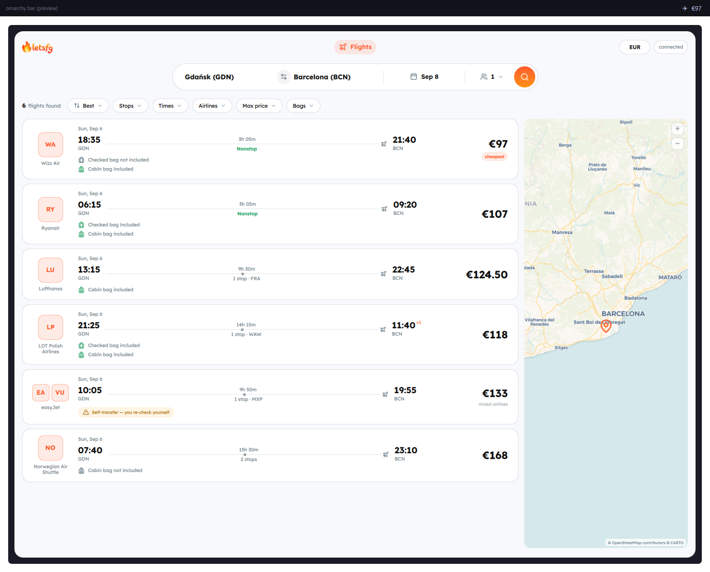

<div align="center">

<a href="https://github.com/LetsFG/LetsFG">
  
</a>

<br>

# We're LetsFG — a community of travelers.

Finding a flight or hotel shouldn't mean checking 47 tabs. Or 3 hours of searching.<br>
Or having that feeling you could've got a better deal if you'd just waited a little longer.<br>

**So we built something about it.**<br>
No markup. No tracking. No price that goes up because you looked twice.

<br>

[](https://github.com/LetsFG/LetsFG)
&nbsp;&nbsp;
[](https://letsfg.co/en)
&nbsp;&nbsp;
[](https://pypi.org/project/letsfg/)

<br>

[](https://www.instagram.com/letsfg_)
&nbsp;&nbsp;
[](https://www.tiktok.com/@letsfg_)
&nbsp;&nbsp;
[](https://x.com/LetsFG_)

<br>

### Join the community. Help others find cheaper flights. Spread the word.<br>⭐ Star the repo. Share with a friend ✈️

<a href="https://twitter.com/intent/tweet?text=Found%20this.%20Real%20flight%20prices%2C%20zero%20markup.%20Your%20AI%20agent%20can%20search%20%26%20book%20flights%20now.&url=https%3A%2F%2Fgithub.com%2FLetsFG%2FLetsFG"></a>
&nbsp;
<a href="https://www.linkedin.com/sharing/share-offsite/?url=https%3A%2F%2Fgithub.com%2FLetsFG%2FLetsFG"></a>
&nbsp;
<a href="https://reddit.com/submit?url=https%3A%2F%2Fgithub.com%2FLetsFG%2FLetsFG&title=LetsFG%20-%20AI%20flight%20search%20for%20agents.%20Real%20prices%2C%20zero%20markup."></a>
&nbsp;
<a href="https://wa.me/?text=Check%20this%20out!%20LetsFG%20searches%20hundreds%20of%20airlines%20and%20gives%20you%20the%20real%20price.%20No%20markup.%20https%3A%2F%2Fgithub.com%2FLetsFG%2FLetsFG"></a>
&nbsp;
<a href="https://t.me/share/url?url=https%3A%2F%2Fgithub.com%2FLetsFG%2FLetsFG&text=LetsFG%20-%20AI%20flight%20search%20for%20agents.%20Real%20prices%2C%20zero%20markup."></a>
&nbsp;
<a href="mailto:?subject=Check%20out%20LetsFG&body=Found%20this.%20Real%20flight%20prices%2C%20zero%20markup.%20Your%20AI%20agent%20can%20search%20%26%20book%20flights%20now.%0A%0Ahttps%3A%2F%2Fgithub.com%2FLetsFG%2FLetsFG"></a>

---

# Flights and hotels. Both live.

**Hundreds of airlines. Real prices. One function call.**

LetsFG gives your AI agent flight **and hotel** search and booking superpowers. Our server-side engine scans the entire world for the cheapest price. Search is free. Booking is real: the fare is held on your card, a LetsFG booking agent buys the ticket, and you get the airline's PNR.

**The same flight costs $20–$50 less** because you skip OTA inflation, cookie tracking, and surge pricing.

**Agents:** add `https://letsfg.co/developers/api/mcp` as an MCP server. Approving the connection opens letsfg.co/connect, where you add a card in a 0.00 Revolut setup (nothing is charged, no Revolut account needed). That token searches for free and books. **Scripts:** send the same token as `Authorization: Bearer` to the PFS endpoints. **Developer API:** a separate paid product for high-volume commercial use; most agents do not need it. → [Get started](#get-started)

<br>

[](https://github.com/LetsFG/LetsFG)
[](https://pypi.org/project/letsfg/)
[](https://www.npmjs.com/package/letsfg-mcp)
[](https://letsfg.co/developers/connectors/health)
[](https://mcpvault.io/servers/letsfg/health?utm_source=external_badge&utm_medium=referral&utm_campaign=mcp_health_report)
[](LICENSE)

<br>

### Supporters

<a href="https://evomi.com/?utm_source=letsfg&utm_medium=banner">
  
</a>

</div>

---

## Real prices: LetsFG vs Google Flights

We searched 5 routes on Google Flights and LetsFG on the same day (2026-08-05), for flights departing 2026-09-16. Same airline, same number of stops — LetsFG was cheaper every time:

| Route | Airline | Google Flights | LetsFG | You Save |
|-------|---------|---------------|--------|----------|
| LAX → Paris (CDG) | JetBlue, 1 stop | $363 | **$334** | **$29** |
| SFO → London (LHR) | JetBlue, 1 stop | $349 | **$333** | **$16** |
| LA → New York (JFK) | JetBlue, nonstop | $174 | **$157** | **$17** |
| London → Singapore (SIN) | Shenzhen Airlines, 1 stop | $395 | **$380** | **$15** |
| Chicago → Dubai (DXB) | Air Canada + Emirates, 2 stops | $517 | **$461** | **$56** |

> **$133 cheaper across 5 routes** in a verified comparison (2026-08-05). Google Flights inflates on repeat searches; LetsFG returns the same prices however often you run the search, because it reads airlines and the major booking sites directly rather than tracking you.

**Why the difference?** Google Flights only searches its own limited set of airline partners. LetsFG searches **everywhere** — Skyscanner, Kiwi, Kayak, Momondo, plus direct airline websites (Ryanair, United, Southwest, EasyJet, Spirit, Norwegian, AirAsia, and hundreds more). More sources = better prices. No demand-based inflation and no cookie tracking: the same search returns the same prices however often you run it.

---

## Real hotel prices: LetsFG vs Booking.com

Same hotel, same room type, same 2-night stay, same free-cancellation policy — checked on the same day (2026-08-05) for a 2026-09-16 check-in:

| Hotel | Booking.com | LetsFG | You Save |
|-------|------------|--------|----------|
| Hotel Boss, Warsaw | $206 | **$169** | **$37** |
| ibis Styles Paris Gare de l'Est | $663 | **$525** | **$138** |
| Copthorne Tara Hotel, London Kensington | $379 | **$347** | **$32** |

> **$207 cheaper across 3 hotels** in a verified comparison (2026-08-05), matching each property's own free-cancellation rate against Booking.com's free-cancellation rate for the identical dates and room type. Prices quoted in PLN at booking, converted to USD at that day's rate.

**Why the difference?** LetsFG sells at wholesale cost — no markup for demand, no loyalty-program cross-subsidy. You're not paying for the room upfront: 5% books it now, and the remaining 95% isn't due until the hotel's own cancellation deadline. Cancel before that deadline and you lose nothing but the 5%; the rest was never charged. Only free-cancellation, pay-later rates are sold, so every price shown is one you can actually hold risk-free.

---

## Try it right now — no install needed

**Human users:** Use [letsfg.co](https://letsfg.co) and search flights instantly in your browser:

<div align="center">

### 🌐 [**Search on letsfg.co**](https://letsfg.co)

</div>

Search any route, compare live results, and unlock the booking links for the flights you want — no installation needed.

**Agents / scripts (free server-side):** Get a Bearer token by putting a payment method on file (nothing is charged) → use `POST /api/search` and `POST /api/agent-book`. This is **PFS — Programmatic Flight Search** powered by the letsfg.co engine, free for 90 days per token. See [letsfg.co/for-agents](https://letsfg.co/for-agents) for the full guide.

When you're ready to integrate it into your own agent, keep reading.

---

## Three ways to use LetsFG

| | **Path 1 — MCP / CLI / SDK** | **Path 2 — PFS** (Programmatic Flight Search via letsfg.co) | **Path 3 — Developer API** |
|---|---|---|---|
| **Best for** | AI agents (Claude, ChatGPT, Cursor, Windsurf), personal use — easiest way in | Scripts/agents calling the API directly with a Bearer token | High-volume commercial integrations that want prepaid billing. **Most agents should not use this** |
| **Speed** | 8–10 s to first results | 8–10 s to first results | 2–5 s (discover) · 8–10 s to first results (full search) |
| **Search cost** | Free (card connected once, nothing charged) | Free (card connected once, nothing charged) | Prepaid credits ($0.50/$0.20/$0.10 per search, monthly tiers) |
| **Booking** | `book_flight` — fare held on your card, agent buys the ticket, real PNR | `POST /api/agent-book` — same flow | Direct airline URLs |
| **Setup** | Add `https://letsfg.co/developers/api/mcp` as an MCP server, approve, add a card | Same token, sent as `Authorization: Bearer` — see below | [letsfg.co/developers](https://letsfg.co/developers) |
| **Runs where** | Our servers (ranking local in the SDK) | Our servers | Our servers |

- **MCP / CLI / SDK (Path 1):** add `https://letsfg.co/developers/api/mcp` as an MCP server in Claude, ChatGPT, Cursor or Windsurf and approve the connection. The consent step opens **letsfg.co/connect**, where the person adds a card (any card, or Revolut Pay / Google Pay) in a 0.00 Revolut setup: nothing is charged, no Revolut account is needed, and card details go to Revolut, never to LetsFG. The token you get back is card-backed: it searches for free and it can book. The Python and JS SDKs read that token from `LETSFG_BEARER_TOKEN` or `~/.letsfg/config.json` and apply the open-source ranking algorithm locally. (A connect-flow login for the CLI is coming; `letsfg auth` still points at the retired Stripe enrolment and does not issue a token.)

- **PFS — Programmatic Flight Search (Path 2):** For scripts and agents that call the API directly. letsfg.co is human-only by default (Cloudflare Turnstile + bot protection), so the card-backed token from the connect flow is the only programmatic way in. Send it on every request:
  1. Search: `POST https://letsfg.co/api/search` with `Authorization: Bearer <token>` → `{ search_id }`
  2. Poll: `GET https://letsfg.co/api/results/<search_id>` (never counts against the rate limit)
  3. Book: `POST https://letsfg.co/api/agent-book` → `{ booking_ref }` within seconds
  4. Wait: `POST https://letsfg.co/api/agent-book/status` with `{ booking_ref }` every 20–30 s until `completed` (PNR), `failed` (hold released, nothing charged) or `needs_attention`

  `POST /api/agent-access/request` still answers `402` with `add_card_url` and these steps as JSON, so an agent that starts from the endpoint lands in the same place. The MPP lane (a wallet, no card) is unchanged: answer the `WWW-Authenticate: Payment` challenge ($0.01 once) and verify with `Authorization: Payment`. The Stripe `setup_url` / SetupIntent lanes were retired on 2026-09-02 and every token they issued was revoked; reconnect at letsfg.co/connect. Full guide and response schema: [letsfg.co/for-agents](https://letsfg.co/for-agents).

- **Developer API (Path 3):** Paid server-side search at [letsfg.co/developers](https://letsfg.co/developers). Prepaid credits, direct airline booking URLs (no checkout step), full NL query parsing, and a `/discover` endpoint that checks 20 destinations in one call for 1 credit (2–5 s). Includes a free sandbox at `/sandbox/flights/*`. Full docs: [letsfg.co/developers/api/docs](https://letsfg.co/developers/api/docs).

> **Free server-side search:** Use Path 1 or PFS — connect a card once at letsfg.co/connect (nothing charged) and searches run free on our servers. No Playwright, no local install beyond the SDK.<br>
> **Direct booking URLs with no per-booking fee:** Use the Developer API (Path 3) — prepaid credits, instant results, no checkout layer.

---

## Pricing

| How you use it | Search | Flight booking | Hotel booking | Runs where? |
|----------------|--------|----------------|----------------|-------------|
| **MCP Server** | ✅ Free (card connected once at letsfg.co/connect) | Fare + markup held, captured on a real PNR. No separate fee | 5% reservation fee | Our servers |
| **CLI / Python SDK / npm** | ✅ Free (same token) | Same | 5% non-refundable reservation fee | Our servers |
| **PFS** (raw API via letsfg.co) | ✅ Free (same token, or $0.01 once via MPP) | Same | 5% reservation fee | Our servers |
| **Developer API** | Prepaid credits | Included (direct airline URLs) | 5% reservation fee | Our servers |

**MCP / CLI / SDK / PFS = free search, real booking, no separate fee.** Connect a card once (a 0.00 Revolut setup, nothing is charged) and searching is free. No credits, no unlock step. Booking works exactly like the website checkout: `book_flight` / `POST /api/agent-book` **holds** the fare plus LetsFG's markup on your card, a LetsFG booking agent buys the ticket from the seller, and the hold is captured only once a real airline PNR exists. If the booking fails the hold is released and nothing is charged. The price you see is the price you pay; the markup is inside it, nothing is added at booking.

**Hotels = 5% now to hold a free-cancellation rate, on every path.** That 5% is what pays for flexibility: it books the room today, but the remaining 95% isn't charged until the hotel's own cancellation deadline, paid straight to the hotel via a `pay_link`. Cancel before that deadline and the only cost is the 5% already paid. See [Hotels](#-hotels--new-and-live) above.

**Developer API = prepaid, business use.** [letsfg.co/developers](https://letsfg.co/developers) returns direct airline booking URLs with no per-booking fee. Monthly billing: $0.50/search for the first 10, $0.20 for 11–1,000, then $0.10/search. Resets monthly. Minimum top-up: $5.

> 💡 **Know someone who travels?** The more people discover LetsFG, the more airlines we cover — and the better it gets for everyone. **[⭐ Star](https://github.com/LetsFG/LetsFG)** · **[Share with a friend](#-join-the-community-)**

---

## Why developers star this repo

| | Google Flights / Expedia | **LetsFG** |
|---|---|---|
| Price | Inflated (tracking, cookies, surge) | **Stable across repeat searches. $133 cheaper across 5 routes, verified 2026-08-05.** |
| Coverage | Misses budget airlines | **Hundreds of airlines — OTAs, budget carriers, full-service** |
| Speed | 30 s+ (page loads, ads, redirects) | **CLI/PFS: 8–10 s to first results · API discover: 2–5 s** |
| Repeat search raises price? | Yes | **Never** |
| Works in AI agents? | No API | **MCP · CLI · PFS (card connected once, free) · Developer API (prepaid)** |
| Booking | Redirects to OTA checkout | **Real airline PNR, e-ticket to inbox** |
| Cabin class filter | No | **Economy, premium, business, first** |
| Cost to you | Hidden markup | **CLI/PFS: free search, no LetsFG fee on booking. Developer API: prepaid credits.** |

---

## Get started

Everything runs on our servers. One card connection covers the MCP, the SDKs and the raw API.

### 🔌 MCP — connect once, search and book

Add the remote server and approve the connection. The consent step opens letsfg.co/connect: add a card (or pay 0.00 with Revolut Pay / Google Pay), nothing is charged, and you are in.

```bash
# Claude Code
claude mcp add --transport http letsfg https://letsfg.co/developers/api/mcp
```

```json
// Cursor (~/.cursor/mcp.json) — Windsurf uses "serverUrl" instead of "url"
{ "mcpServers": { "letsfg": { "url": "https://letsfg.co/developers/api/mcp" } } }
```

claude.ai and ChatGPT: add a custom connector with the same URL.

Then, in the chat: *"find me the cheapest flight from London to Barcelona on June 15 and book it"*. `search_flights` returns offers; `book_flight` holds the fare on your card and starts a LetsFG booking agent; `get_flight_booking` reports the PNR when it lands (4–11 minutes).

### 🖥️ CLI / SDK — same token, ranking runs locally

```bash
pip install letsfg
export LETSFG_BEARER_TOKEN=<token from the connect flow>
letsfg search LHR BCN 2026-06-15
letsfg search LHR JFK 2026-06-15 --cabin C   # cabin class: M economy, W premium, C business, F first
```

The SDKs read the token from `LETSFG_BEARER_TOKEN` or `~/.letsfg/config.json`. A connect-flow login for the CLI is coming; until then `letsfg auth` still points at the retired Stripe enrolment and does not issue a token.

### 🔌 PFS — Programmatic Flight Search (free, server-side)

Run LetsFG's full search on our servers from any script. **Access requires a card connected to a LetsFG account:** letsfg.co is human-only (Cloudflare Turnstile), so the card-backed token from the connect flow is the only programmatic way in. Nothing is charged to connect it.

```bash
# 1. Search with the token
curl -X POST https://letsfg.co/api/search \
  -H "Authorization: Bearer <token>" \
  -H "Content-Type: application/json" \
  -d '{"origin":"LHR","destination":"BCN","date_from":"2026-06-15"}'
# → {"search_id":"ws_abc123","status":"searching"}

# 2. Poll until done (keep going while split_ticket_pending is true)
curl https://letsfg.co/api/results/ws_abc123 -H "Authorization: Bearer <token>"

# 3. Book — the fare is HELD on the card, a LetsFG agent buys the ticket
curl -X POST https://letsfg.co/api/agent-book \
  -H "Authorization: Bearer <token>" -H "Content-Type: application/json" \
  -d '{"search_id":"ws_abc123","offer_id":"wo_abc123","contact_email":"ada@example.com",
       "passenger":{"given_name":"Ada","family_name":"Lovelace","born_on":"1990-04-01","gender":"f",
                    "nationality":"GB","phone_number":"+447700900000","phone_country":"GB",
                    "address_line1":"1 Analytical Way","address_city":"London","address_postal":"N1 9GU","address_country":"GB"}}'
# → {"booking_ref":"eyJ..."} within seconds

# 4. Wait for the PNR (every 20–30 s; a booking takes 4–11 minutes)
curl -X POST https://letsfg.co/api/agent-book/status \
  -H "Authorization: Bearer <token>" -H "Content-Type: application/json" \
  -d '{"booking_ref":"eyJ..."}'
# → {"state":"completed","pnr":"ABC123","charged_amount":93,"currency":"EUR"}
```

`failed` means the hold was released and nothing was charged; `needs_attention` means a human at LetsFG is checking it, do not book again. A missing passenger detail returns `missing_fields` and charges nothing. Without a card the endpoint answers `payment_method_required` with `add_card_url`. Full guide and response schema: [letsfg.co/for-agents](https://letsfg.co/for-agents).

### ⚡ Developer API — paid, server-side, direct booking URLs

A **separate paid product** for high-volume commercial integrations; most agents should not use it. Prepaid credits, results in seconds, direct airline booking URLs — plus `/discover` (20 destinations in one call, 1 credit), async polling, NL query parsing, and a free sandbox.

```bash
# Register, then search with your API key
curl -X POST https://letsfg.co/developers/api/v1/agents/register \
  -H "Content-Type: application/json" \
  -d '{"agent_name":"my-agent","email":"you@example.com"}'

curl -X POST https://letsfg.co/developers/api/v1/flights/search \
  -H "X-API-Key: letsfg_..." \
  -H "Content-Type: application/json" \
  -d '{"origin":"LHR","destination":"BCN","date_from":"2026-06-15"}'
```

Pricing: $0.50/search for the first 10 each month, $0.20 for 11–1,000, $0.10 beyond. Minimum top-up $5. Test for free in the sandbox first. Full docs: [letsfg.co/developers/api/docs](https://letsfg.co/developers/api/docs).

<details>
<summary><strong>Full search → book flow (MCP / PFS agent path, no unlock step)</strong></summary>

```
search_flights  LON → BCN, 2026-04-01, return 2026-04-08
get_flight_results  (while more offers are still landing)
book_flight     search_id + offer_id + one traveller's real details + contact_email
                → booking_ref in seconds; fare + markup HELD on the connected card
get_flight_booking  every 20–30 s → completed (PNR, charged_amount) | failed (hold released) | needs_attention
```

Over raw HTTP the same four steps are `POST /api/search`, `GET /api/results/<id>`, `POST /api/agent-book`, `POST /api/agent-book/status`.

`letsfg unlock` is a **Developer API–only** command for the paid, prepaid-credit
product above — it isn't part of this flow. See [CLI Commands](#cli-commands).

</details>

> 💡 **Like what you see?** Support us — **[⭐ Star](https://github.com/LetsFG/LetsFG)** · **[Share with a friend](#-join-the-community-)**

---

## Works everywhere your agent runs

### MCP Server (Claude / ChatGPT / Cursor / Windsurf / OpenClaw)

Use the hosted server. It carries your card-backed token for you, and `book_flight` books for real.

```json
{
  "mcpServers": {
    "letsfg": {
      "url": "https://letsfg.co/developers/api/mcp"
    }
  }
}
```

Approve the connection when your client asks; the consent step opens letsfg.co/connect, where a card is added in a 0.00 setup (nothing is charged). Tools: `search_flights`, `get_flight_results`, `book_flight`, `get_flight_booking`, plus the hotel tools.

The stdio package (`npx -y letsfg-mcp`) still works for search if you give it a token in `LETSFG_BEARER_TOKEN`; its own `authenticate` tool points at the retired Stripe enrolment and is being moved to the connect flow.

<details>
<summary>Optional: use the Developer API instead (paid, prepaid credits, direct booking URLs)</summary>

```json
{
  "mcpServers": {
    "letsfg": {
      "command": "npx",
      "args": ["-y", "letsfg-mcp"],
      "env": {
        "LETSFG_API_KEY": "letsfg_your_api_key"
      }
    }
  }
}
```

This is a **separate paid product** for high-volume commercial use — most agents should stick with the free connect flow above and skip this. A human setting this up deliberately gets a key at [letsfg.co/developers](https://letsfg.co/developers).

</details>

**5-minute quickstarts:** [Claude Desktop](docs/quickstart-claude.md) · [Cursor](docs/quickstart-cursor.md) · [Windsurf](docs/quickstart-windsurf.md)

### Python SDK

```python
from letsfg import LetsFG

bt = LetsFG()  # reads LETSFG_API_KEY from env
flights = bt.search("LHR", "JFK", "2026-04-15")
print(f"{flights.total_results} offers, cheapest: {flights.cheapest.summary()}")
```

### JavaScript SDK

```typescript
import { LetsFG } from 'letsfg';

const bt = new LetsFG({ apiKey: 'letsfg_...' });
const flights = await bt.search('LHR', 'JFK', '2026-04-15');
console.log(`${flights.totalResults} offers`);
```

### Python SDK (cloud search)

```python
from letsfg.local import search_local

# Reads LETSFG_BEARER_TOKEN env var or ~/.letsfg/config.json (the token from the connect flow)
result = await search_local("GDN", "BCN", "2026-06-15")

for offer in result.offers[:5]:
    print(f"{offer.airlines[0]}: {offer.currency} {offer.price}")
```

---

## ⇄ Split tickets — two tickets, one trip

A long-haul searched as one journey comes back as one through-fare, because
everyone is reselling the same ticket. Searched as two independent legs through
a hub, each leg is booked from whatever is cheapest for that hop — whichever
airline, whichever seller. Usually that lands on two different airlines (often a
low-cost carrier for the short leg and a separate airline for the long one), but
the only rule is "cheapest for each leg". Nobody sells the combination as one
ticket, so nobody quotes it — which is exactly why it is cheaper.

LetsFG builds that itinerary for you and returns it alongside the through-fares.
Split offers are flagged, never disguised:

| Field | Value on a split offer |
|---|---|
| `split_ticket` | `"true"` |
| `combo_type` | `"virtual_interlining"` |
| `self_transfer` | `"unprotected"` |

```python
for o in offers:
    if o.get("split_ticket") == "true":
        print(o["price"], "— two separate tickets, self-transfer not protected")
```

**Read `self_transfer` before you present the price.** `unprotected` means the
two tickets are not linked: if the first flight is late and the connection is
missed, the second airline owes nothing — no rebooking, no refund, no
duty of care. That is the trade you are being offered in exchange for the
saving, and it has to reach the traveller. We only build a split when the
connection has a real buffer, and we say so on the offer — but an
agent that relays the price without the condition is misrepresenting it.

**The probe is gated.** Two extra connector fan-outs cost real money, so a
split is only attempted when the through-fare is expensive enough, the journey
long enough, and the market has somewhere to break the trip. Most searches
never fire it, and a search that fires it does not always find a saving.

**It lands after `completed`.** See
[Polling: `completed` is not the end](#polling-completed-is-not-the-end).

**Where it runs.** letsfg.co, and the agent lane behind it — the CLI,
the Python and JS SDKs, and the MCP server. The paid Developer API is served by
a different backend; `self_transfer` is returned there, but split-ticket offers
are not part of that contract.


### What it actually saves

<!-- SPLIT-TABLE:START — generated by tools/split-comparison.py, do not hand-edit -->
| Route | Cheapest single ticket | Split — two tickets | You save | Connect via | Two airlines | Layover |
|---|---|---|---|---|---|---|
| Stuttgart → Shanghai | $552 | **$461** | **$91 (16%)** | Budapest | Wizz Air + Qatar Airways | 6 h |
| Katowice → Dubai | $283 | **$216** | **$67 (24%)** | Istanbul | Wizz Air + Pegasus | 15 h |
| Chongqing → Gdansk | $429 | **$387** | **$42 (10%)** | Stockholm | China Eastern + Ryanair | 10 h |
| Vilnius → Bangkok | $370 | **$337** | **$33 (9%)** | Athens | Ryanair + Air Arabia | 5 h |
| Shanghai → Vilnius | $406 | **$377** | **$29 (7%)** | London | Shenzhen Airlines + Wizz Air | 12 h |

<sub>Measured August 2026 on live searches (one adult, one way, ~2 months out). Each split is <strong>two separate tickets</strong> (here, two different airlines) with an <strong>unprotected self-transfer</strong> — if the first flight is late, the second airline owes you nothing. Prices move constantly; these won't reproduce exactly. 5 of 26 long-haul routes searched produced a split cheaper than the best single ticket — the win shows up at secondary cities with no cheap direct long-haul. Regenerate with <code>tools/split-comparison.py</code>.</sub>
<!-- SPLIT-TABLE:END -->

The numbers above come from real searches and are reproducible: the script runs
the same public search anyone can run, compares the cheapest split against the
cheapest single ticket **in the same result set**, and writes the raw offers to
`split-comparison.json` so any row can be checked. Routes that produced no split
are reported too rather than dropped quietly — most searches never fire
a split probe, and a table that hid that would misrepresent how often this
happens.

## ✦ Starlink Wi-Fi on results

Offers tell you whether the flight has Starlink, in two honest tiers. A solid
verdict (`confirmed_all`) means the airline has fitted **every** aircraft of that
type. A hedged one (`likely_all`) means the rollout on that type is real but
incomplete — as of August 2026 United was ~29% of its fleet — so it is reported
as a signal, never a promise. An absent field means no information, not an
absence of Wi-Fi.

```python
for o in offers:
    if o.get("starlink") == "confirmed_all":
        print(f"{o['owner_airline']} {o['price']} — Starlink on every leg")
```

Full semantics: [docs/api-search.md](docs/api-search.md#starlink-wi-fi).

## 🏨 Hotels — new, and live

Your agent can now book hotels, not just flights. Same API key, same card on file.

```python
from letsfg import LetsFG
lfg = LetsFG()

city = lfg.hotel_destinations("Warsaw")[0]
stays = lfg.search_hotels(
    city_id=city["Id"], city_name=city["Name"],
    check_in="2026-11-10", check_out="2026-11-12", adults=2,
)

hotel = stays["hotels"][0]
offer = hotel["offers"][0]
print(hotel["name"], offer["price"], stays["currency"])
# Hotel Gromada Warszawa Centrum 669.86 PLN

booking = lfg.book_hotel_and_wait(
    session_id=stays["session_id"],
    hotel_code=hotel["hotel_code"],
    combination_id_v2=offer["combination_id_v2"],
    expected_price=offer["price"],
    expected_balance=offer["balance_to_supplier"],
    city_id=city["Id"], city_name=city["Name"],
    check_in="2026-11-10", check_out="2026-11-12",
    guests=[{"title": "Mr", "first_name": "Jan", "last_name": "Kowalski"}],
    email="guest@example.com", phone="512345678",
)
print(booking["confirmation"], booking["pay_link"])
```

### How you pay

**5% now, the rest to the hotel later.** At booking we charge 5% of the price
to your card as a reservation fee. The remaining balance is paid **directly to
the supplier** through a `pay_link` we return — we never hold it.

`balance_due_by` is the supplier's own auto-cancellation date, not a date we
invent. Miss it and the room is released.

The 5% is **non-refundable**. Cancelling before `balance_due_by` costs nothing
else; after it, the hotel's own cancellation ladder applies and can reach 100%.
That ladder ships in the booking's `terms`, so you can always see the cost before
you cancel.

### Things worth knowing before you build

- **A card on file is required for every hotel call, including search.** That is
  unusual and it is deliberate: a hotel search opens a real session at the
  supplier, and booking blocks a real rate. We would rather refuse up front than
  let you reach the point of commitment and discover you cannot pay. The same
  card that authorises flight booking authorises hotels — there is no separate
  hotel signup.
- **Only free-cancellation, pay-later rates are sold.** Those are the rates where
  the balance can safely be settled with the supplier after booking, which is
  what makes 5%-now/rest-later work at all. You will see fewer results than a
  metasearch shows you. Every one of them can actually be booked.
- **Booking is asynchronous.** `book_hotel` returns a `booking_job_id`, not a
  booking — the real thing takes minutes. Poll `hotel_booking(job_id)` until
  `status` is `succeeded` or `failed`, or call `book_hotel_and_wait` and let the
  SDK do it. This is not ceremony: it is what makes it impossible to charge a
  card and then lose the confirmation to a timeout.
- **The fee is charged before the room is committed.** A declined card therefore
  costs nothing to unwind — no reservation exists and nothing is charged.
- **Do not retry a booking blindly.** Calling `book_hotel` twice for the same
  rate books the room twice and charges two reservation fees.
- `price` is what the guest pays. There is no wholesale figure in the response to
  quote by mistake.

### JavaScript

```javascript
import { LetsFG } from 'letsfg';
const lfg = new LetsFG({ apiKey: process.env.LETSFG_API_KEY });

const [city] = await lfg.hotelDestinations('Warsaw');
const stays = await lfg.searchHotels({
  cityId: city.Id, cityName: city.Name,
  checkIn: '2026-11-10', checkOut: '2026-11-12', adults: 2,
});

const booking = await lfg.bookHotelAndWait({ /* ...offer + guest details... */ });
console.log(booking.confirmation, booking.pay_link);
```

### MCP

Five new tools, in the order you call them: `resolve_hotel_city` →
`search_hotels` → `book_hotel` → `get_hotel_booking` → `cancel_hotel_booking`.


---

## 🖥️ Omarchy desktop plugin

Search hundreds of airlines from the [Omarchy](https://omarchy.org) bar. Type
two airport codes and a date, press Search, click an offer to open it. The
panel lives in this repo — `manifest.json`, `BarWidget.qml`, `Panel.qml` and
`Model.js` at the root — and runs on the same engine as the CLI and the MCP
server, ordered by the same open-source ranking algorithm in `sdk/js/src/ranking.ts`.

<p align="center"></p>

**Install**

```bash
omarchy plugin add https://github.com/LetsFG/LetsFG.git --enable
```

Then add **LetsFG Flights** to a bar section in the Omarchy bar settings. The
panel reads your LetsFG token from `~/.letsfg/config.json`; the in-panel
**Add a card** button used the retired Stripe enrolment and is being moved to
the connect flow. See [OMARCHY-PLUGIN.md](OMARCHY-PLUGIN.md).

**Remove**

```bash
omarchy plugin remove io.github.letsfg.flights
```

That removes the plugin only. Your token is yours — delete
`~/.letsfg/config.json` yourself if you want it gone.

**The plugin bundles no API keys.** It authenticates with a token you create
and can revoke, it never asks for card details, and it never starts a search on
its own — no background poll, no price watch, no refresh timer. Every host it
can contact, every file it reads or writes, and the anonymous installation id
it sends so we can tell whether anyone is using it, are documented in full in
**[OMARCHY-PLUGIN.md](OMARCHY-PLUGIN.md)**.

Requires the Omarchy Quattro shell. MIT, like the rest of this repo. Not
affiliated with, sponsored by, or endorsed by Omarchy or 37signals.

---

## Install

| Package | Command | What you get |
|---------|---------|--------------|
| **Remote MCP** | `https://letsfg.co/developers/api/mcp` | No install. Approve the connection, add a card at letsfg.co/connect, search and book |
| **Python SDK + CLI** | `pip install letsfg` | SDK + CLI (token from the connect flow in `LETSFG_BEARER_TOKEN`) |
| **MCP Server (stdio)** | `npx letsfg-mcp` | Local server for clients without remote MCP support; needs `LETSFG_BEARER_TOKEN` |
| **JS/TS SDK** | `npm install -g letsfg` | SDK + CLI + open-source ranking engine |
| **Agent Skill** | `npx skills add LetsFG/LetsFG` | Install flight search skill for any AI agent ([skills.sh](https://skills.sh)) |
| **Smithery** | [smithery.ai/servers/letsfg](https://smithery.ai/servers/letsfg) | One-click MCP install |
| **Omarchy plugin** | `omarchy plugin add https://github.com/LetsFG/LetsFG.git --enable` | Flight search in the Omarchy bar ([details](OMARCHY-PLUGIN.md)) |

---

## CLI Commands

| Command | Description |
|---------|-------------|
| `letsfg auth` | Being moved to the connect flow (letsfg.co/connect). Currently points at the retired Stripe enrolment and does not issue a token; set `LETSFG_BEARER_TOKEN` instead |
| `letsfg search <origin> <dest> <date>` | Search flights (free with a card-backed token) |
| `letsfg register` | **[Developer API only]** Register an account for the paid, prepaid-credit product — not part of the agent flow |
| `letsfg setup-payment` | **[Developer API only]** Attach a payment method (required for `unlock`) — not part of the agent flow |
| `letsfg recover --email <email>` | Recover lost API key via email |
| `letsfg locations <query>` | Resolve city/airport to IATA codes |
| `letsfg unlock <offer_id>` | **[Developer API only]** Confirm live price and reveal the booking URL. Legacy — not part of the agent flow, use `letsfg book` |
| `letsfg book <offer_id>` | Book the flight: holds the fare on the connected card, a LetsFG agent buys the ticket, returns a `booking_ref` to poll |
| `letsfg me` | View profile & usage stats |

All commands accept `--json` for structured output and `--api-key` to override the env variable.

---

## How it works

### CLI / SDK / MCP (free, cloud-backed)

```
Connect the MCP (once, card added at letsfg.co/connect) → card-backed token → Search (free) → Book (hold → agent → PNR)
```

1. **Auth** — add `https://letsfg.co/developers/api/mcp` as an MCP server and approve it. The OAuth consent step opens letsfg.co/connect, where a card is added in a 0.00 Revolut setup. Nothing is charged. The SDKs read that token from `LETSFG_BEARER_TOKEN` or `~/.letsfg/config.json`.
2. **Search** — `letsfg search LHR BCN 2026-06-15` calls `POST https://letsfg.co/api/search`, polls until done (8–10 s to first results), and applies the open-source ranking algorithm locally.
3. **Book** — `POST /api/agent-book` holds the fare plus markup on the card and starts a LetsFG booking agent; `POST /api/agent-book/status` reports `completed` with the PNR (4–11 minutes), or `failed` with the hold released. Nothing extra is added at booking.

### Polling: `completed` is not the end

A search returns in 8–10 s to first results. Poll `GET /api/results/<search_id>`
**immediately** and then every 2 s — a loop that sleeps first puts a
floor under a search that is already faster than the sleep.

When `status` leaves `searching`, the connector fan-out is done — but
the offer set may still be growing. The split-ticket probe is dispatched after
the fan-out and merges its result in late, so the cheapest itinerary on the
search is routinely one that does not exist yet at the moment the status turns
terminal. The response says so:

| Flag | Meaning while `true` |
|---|---|
| `split_ticket_pending` | a split-ticket probe is still running |
| `gf_enrich_pending` | the Google Flights enrich has not merged yet |

Keep polling while either is true, and **bound the wait** — a flag
that never clears must not hang your agent. Take whatever has landed when the
bound expires.

The Python and JS SDKs and the MCP server already do this, with a 90 s ceiling
— the same window the server uses to decide a result has settled.
So a search that fires a split probe can take meaningfully longer than the
8–10 s to first results fast path, and it is the split offer you are waiting for.
Set `LETSFG_WAIT_FOR_SPLIT=0` if you would rather have the fast answer.

Most searches never fire the probe, so both flags are usually already false on
the first poll and this costs nothing.

### PFS — raw API (same as CLI, without the wrapper)

```
Card connected at letsfg.co/connect -> Bearer token -> POST /api/search -> poll GET /api/results/<id> -> POST /api/agent-book -> poll POST /api/agent-book/status
```

1. **Get a Bearer token** — connect through the MCP OAuth flow; the consent step is letsfg.co/connect (card or Revolut Pay, 0.00, nothing charged). `POST /api/agent-access/request` answers `402` with `add_card_url` and the steps. The MPP wallet lane ($0.01 once) verifies at `POST /api/agent-access/verify` with `Authorization: Payment`.
2. **Search** — `POST https://letsfg.co/api/search` with `Authorization: Bearer <token>`. Returns `{ search_id }`. Poll `GET /api/results/<search_id>` immediately, then every 2 s, until `status` leaves `searching`. Then keep polling while `split_ticket_pending` or `gf_enrich_pending` is true — the split-ticket offer merges in after the status turns terminal.
3. **Book** — `POST /api/agent-book` → `booking_ref`; poll `POST /api/agent-book/status` until `completed` (PNR) or `failed` (hold released, nothing charged).

### Developer API — paid, direct booking URLs

```
Register → Fund balance → Discover or Search (credits) → Direct booking URL (no checkout)
```

1. **Discover** — `POST /flights/discover` with up to 20 destinations, get indicative prices sorted cheapest-first. 1 credit, 2–5 s. Use to rank options before committing to a full search.
2. **Full search** — `POST /flights/search` (blocking) or `/flights/search/async` (non-blocking + poll). 1 credit, 8–10 s to first results.
3. **Book** — each offer includes a direct airline `booking_url`. No LetsFG fee, no checkout step.

<details>
<summary><strong>Virtual interlining</strong></summary>

The server-side engine builds cross-airline round-trips by combining one-way fares from different carriers. A Ryanair outbound + Wizz Air return can save 30-50% vs booking a round-trip on either airline alone.

</details>

<details>
<summary><strong>City-wide airport expansion</strong></summary>

Search a city code and LetsFG automatically searches all airports in that city. `LON` expands to LHR, LGW, STN, LTN, SEN, LCY. `NYC` expands to JFK, EWR, LGA. Works for 25+ major cities worldwide.

</details>

---

## Architecture

**CLI / SDK / MCP / PFS**
```
CLI / SDK / MCP / AI Agent
        │  Card connected at letsfg.co/connect -> card-backed Bearer token
        ▼
POST letsfg.co/api/search  (bot-protected, token required)
        │
        ▼
letsfg.co server-side search engine
        │
        ▼
GET /api/results/<search_id>  (poll every 2 s; keep going while split_ticket_pending)
        │
        ▼
Ranking applied locally (sdk/js/src/ranking.ts, open-source)
        │
        ▼
Results + booking via POST /api/agent-book (hold on card -> LetsFG agent -> PNR)
```

**Developer API**
```
Product / Team / Agent
        │  API key + prepaid credits
        ▼
letsfg.co/developers/api/v1
  ├─ /flights/discover      (indicative prices, 20 dest, 1 credit, 2–5 s)
  ├─ /flights/search        (full search, 1 credit, 8–10 s to first results)
  ├─ /flights/search/async  (non-blocking + poll)
  ├─ /flights/parse-query   (Gemini NL parsing, free)
  └─ /sandbox/flights/*     (fake data, same schema, free)
        │
        ▼
Direct airline booking_url - no checkout step
```

<details>
<summary><strong>Airlines covered</strong></summary>

| Region | Airlines |
|--------|----------|
| **Europe** | Ryanair, Wizz Air, EasyJet, Norwegian, Vueling, Eurowings, Transavia, Pegasus, Turkish Airlines, Condor, SunExpress, Volotea, Smartwings, Jet2, LOT Polish Airlines, Finnair, SAS, Aegean, Aer Lingus, ITA Airways, TAP Portugal, Icelandair, PLAY |
| **Middle East & Africa** | Emirates, Etihad, Qatar Airways, flydubai, Air Arabia, flynas, Salam Air, Air Peace, FlySafair, EgyptAir, Ethiopian Airlines, Kenya Airways, Royal Air Maroc, South African Airways |
| **Asia-Pacific** | AirAsia, AirAsia X, IndiGo, SpiceJet, Akasa Air, Air India, Air India Express, Alliance Air, Star Air, EaseMyTrip OTA, VietJet, Cebu Pacific, Scoot, Jetstar, Peach, Spring Airlines, Lucky Air, 9 Air, Nok Air, Batik Air, Jeju Air, T'way Air, ZIPAIR, Skymark, H.I.S. Travel OTA, Singapore Airlines, Cathay Pacific, Malaysian Airlines, Thai Airways, Korean Air, ANA, JAL, Qantas, Virgin Australia, Bangkok Airways, Air New Zealand, Garuda Indonesia, Philippine Airlines, US-Bangla, Biman Bangladesh |
| **Americas** | Southwest, JetBlue, Frontier, Spirit, Allegiant, Avelo, Breeze, Sun Country, Flair, Porter, WestJet, Volaris, VivaAerobus, GOL, Azul, LATAM, JetSmart, Flybondi, Arajet, Wingo, Sky Airline, Copa, Avianca |
| **Oceania** | Rex, Bonza, Link Airways, Air Vanuatu, Fiji Airways |

</details>

---

## Star History

<a href="https://www.star-history.com/?repos=LetsFG%2FLetsFG&type=date&legend=top-left">
  <picture>
    <source media="(prefers-color-scheme: dark)" srcset="https://letsfg.co/api/stars/history?theme=dark" />
    <source media="(prefers-color-scheme: light)" srcset="https://letsfg.co/api/stars/history?theme=light" />
    
  </picture>
</a>

---

<div align="center">

**[letsfg.co](https://letsfg.co)** · **[API Docs](https://letsfg.co/developers/api/docs)** · **[Connector Health](https://letsfg.co/developers/api/v1/analytics/connectors/health)** · **[PyPI](https://pypi.org/project/letsfg/)** · **[npm](https://www.npmjs.com/package/letsfg-mcp)** · **[Smithery](https://smithery.ai/servers/letsfg)** · **[Instagram](https://www.instagram.com/letsfg_)** · **[TikTok](https://www.tiktok.com/@letsfg_)** · **[X](https://x.com/LetsFG_)**

*Open source · MIT License · Made with ❤️ by travelers, for travelers*

Want updates? Click **Watch** above, or follow [LetsFG on Instagram](https://www.instagram.com/letsfg_), [@letsfg_ on TikTok](https://www.tiktok.com/@letsfg_), or [@LetsFG_ on X](https://x.com/LetsFG_).

</div>
