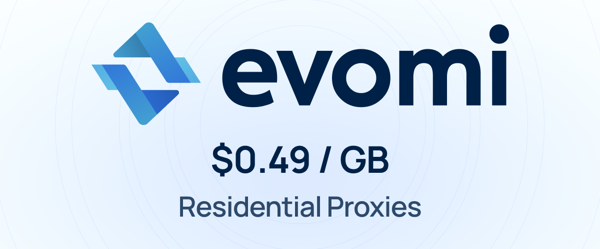

> **MPP (updated 2026-07-30):** the MPP (Machine Payments Protocol) `402`
> challenge is **live**, as a card-free *enrolment* lane for agents holding a
> Tempo wallet. It costs **$0.01 once**, as verification only — MPP has no
> zero-amount intent, so a card-free rail has to settle something. Search and
> booking stay free. Earlier revisions of this page described an MPP charge at
> *unlock* time; that never shipped. See <https://letsfg.co/for-agents>.


> ### ⚠️ Agents: do not create a Developer API account
>
> Do **NOT** call `/developers/api/v1/agents/register` or
> `/developers/api/v1/agents/setup-payment`, and do **NOT** run
> `letsfg register` or `letsfg setup-payment`. Those belong to a separate,
> paid, prepaid-balance product for high-volume commercial integrations and
> create a billing account you almost certainly do not want.
>
> To search and book flights, run `letsfg auth` — a zero-amount card setup
> (nothing charged), then search and book. See <https://letsfg.co/for-agents>.
<div align="center">

<a href="https://github.com/LetsFG/LetsFG">
  
</a>

<br>

# We're LetsFG — a community of travelers.

Planning a trip shouldn't mean 47 tabs open, 3 hours of searching, and that feeling you could've got a better deal if you'd just waited a little longer.<br>
Then a separate app to watch for delays. Then another one for the ride to the airport.

**So we're building one thing that handles all of it.**<br>
The real best deal, across every airline and OTA. The right airport when your city has three. Ground transport on the other end. Someone watching your flight so a delay or cancellation gets handled before you're the one stuck in a line.

No markup. No tracking. No price that goes up because you looked twice.

Search and booking work today, right here in this repo. The rest is what we're building next.

<br>

[](https://github.com/LetsFG/LetsFG)
&nbsp;&nbsp;
[](https://letsfg.co/en)
&nbsp;&nbsp;
[](https://pypi.org/project/letsfg/)

<br>

[](https://www.instagram.com/letsfg_)
&nbsp;&nbsp;
[](https://www.tiktok.com/@letsfg_)
&nbsp;&nbsp;
[](https://x.com/LetsFG_)

<br>

### Join the community. Help others find cheaper flights. Spread the word.<br>⭐ Star the repo. Share with a friend ✈️

<a href="https://twitter.com/intent/tweet?text=Found%20this.%20Real%20flight%20prices%2C%20zero%20markup.%20Your%20AI%20agent%20can%20search%20%26%20book%20flights%20now.&url=https%3A%2F%2Fgithub.com%2FLetsFG%2FLetsFG"></a>
&nbsp;
<a href="https://www.linkedin.com/sharing/share-offsite/?url=https%3A%2F%2Fgithub.com%2FLetsFG%2FLetsFG"></a>
&nbsp;
<a href="https://reddit.com/submit?url=https%3A%2F%2Fgithub.com%2FLetsFG%2FLetsFG&title=LetsFG%20-%20AI%20flight%20search%20for%20agents.%20Real%20prices%2C%20zero%20markup."></a>
&nbsp;
<a href="https://wa.me/?text=Check%20this%20out!%20LetsFG%20searches%20hundreds%20of%20airlines%20and%20gives%20you%20the%20real%20price.%20No%20markup.%20https%3A%2F%2Fgithub.com%2FLetsFG%2FLetsFG"></a>
&nbsp;
<a href="https://t.me/share/url?url=https%3A%2F%2Fgithub.com%2FLetsFG%2FLetsFG&text=LetsFG%20-%20AI%20flight%20search%20for%20agents.%20Real%20prices%2C%20zero%20markup."></a>
&nbsp;
<a href="mailto:?subject=Check%20out%20LetsFG&body=Found%20this.%20Real%20flight%20prices%2C%20zero%20markup.%20Your%20AI%20agent%20can%20search%20%26%20book%20flights%20now.%0A%0Ahttps%3A%2F%2Fgithub.com%2FLetsFG%2FLetsFG"></a>

---

# Flights and hotels. Both live.

**Hundreds of airlines. Real prices. One function call.**

LetsFG gives your AI agent flight **and hotel** search and booking superpowers. Our server-side engine scans the entire world for the cheapest price. Search is free. Real airline tickets, booked through us or handed to you as a direct link.

**The same flight costs $20–$50 less** because you skip OTA inflation, cookie tracking, and surge pricing.

**CLI or scripts:** Run `letsfg auth` once — it puts a payment method on file through a zero-amount Stripe setup (nothing is charged) and returns a 90-day token. Then `letsfg search` and `letsfg book` hit our cloud engine. **Developer API:** a separate paid product for high-volume commercial use; most agents do not need it. → [Get started](#get-started)

<br>

[](https://github.com/LetsFG/LetsFG)
[](https://pypi.org/project/letsfg/)
[](https://www.npmjs.com/package/letsfg-mcp)
[](https://letsfg.co/developers/connectors/health)
[](https://smithery.ai/servers/letsfg)
[](LICENSE)

<br>

### Supporters

<a href="https://evomi.com/?utm_source=letsfg&utm_medium=banner">
  
</a>

</div>

---

## 🏨 Hotels — new, and live

Your agent can now book hotels, not just flights. Same API key, same card on file.

```python
from letsfg import LetsFG
lfg = LetsFG()

city = lfg.hotel_destinations("Warsaw")[0]
stays = lfg.search_hotels(
    city_id=city["Id"], city_name=city["Name"],
    check_in="2026-11-10", check_out="2026-11-12", adults=2,
)

hotel = stays["hotels"][0]
offer = hotel["offers"][0]
print(hotel["name"], offer["price"], stays["currency"])
# Hotel Gromada Warszawa Centrum 669.86 PLN

booking = lfg.book_hotel_and_wait(
    session_id=stays["session_id"],
    hotel_code=hotel["hotel_code"],
    combination_id_v2=offer["combination_id_v2"],
    expected_price=offer["price"],
    expected_balance=offer["balance_to_supplier"],
    city_id=city["Id"], city_name=city["Name"],
    check_in="2026-11-10", check_out="2026-11-12",
    guests=[{"title": "Mr", "first_name": "Jan", "last_name": "Kowalski"}],
    email="guest@example.com", phone="512345678",
)
print(booking["confirmation"], booking["pay_link"])
```

### How you pay

**10% now, the rest to the hotel later.** At booking we charge 10% of the price
to your card as a reservation fee. The remaining balance is paid **directly to
the supplier** through a `pay_link` we return — we never hold it.

`balance_due_by` is the supplier's own auto-cancellation date, not a date we
invent. Miss it and the room is released.

The 10% is **non-refundable**. Cancelling before `balance_due_by` costs nothing
else; after it, the hotel's own cancellation ladder applies and can reach 100%.
That ladder ships in the booking's `terms`, so you can always see the cost before
you cancel.

### Things worth knowing before you build

- **A card on file is required for every hotel call, including search.** That is
  unusual and it is deliberate: a hotel search opens a real session at the
  supplier, and booking blocks a real rate. We would rather refuse up front than
  let you reach the point of commitment and discover you cannot pay. The same
  card that authorises flight booking authorises hotels — there is no separate
  hotel signup.
- **Only free-cancellation, pay-later rates are sold.** Those are the rates where
  the balance can safely be settled with the supplier after booking, which is
  what makes 10%-now/rest-later work at all. You will see fewer results than a
  metasearch shows you. Every one of them can actually be booked.
- **Booking is asynchronous.** `book_hotel` returns a `booking_job_id`, not a
  booking — the real thing takes minutes. Poll `hotel_booking(job_id)` until
  `status` is `succeeded` or `failed`, or call `book_hotel_and_wait` and let the
  SDK do it. This is not ceremony: it is what makes it impossible to charge a
  card and then lose the confirmation to a timeout.
- **The fee is charged before the room is committed.** A declined card therefore
  costs nothing to unwind — no reservation exists and nothing is charged.
- **Do not retry a booking blindly.** Calling `book_hotel` twice for the same
  rate books the room twice and charges two reservation fees.
- `price` is what the guest pays. There is no wholesale figure in the response to
  quote by mistake.

### JavaScript

```javascript
import { LetsFG } from 'letsfg';
const lfg = new LetsFG({ apiKey: process.env.LETSFG_API_KEY });

const [city] = await lfg.hotelDestinations('Warsaw');
const stays = await lfg.searchHotels({
  cityId: city.Id, cityName: city.Name,
  checkIn: '2026-11-10', checkOut: '2026-11-12', adults: 2,
});

const booking = await lfg.bookHotelAndWait({ /* ...offer + guest details... */ });
console.log(booking.confirmation, booking.pay_link);
```

### MCP

Five new tools, in the order you call them: `resolve_hotel_city` →
`search_hotels` → `book_hotel` → `get_hotel_booking` → `cancel_hotel_booking`.


## Three ways to use LetsFG

| | **Path 1 — CLI / SDK** | **Path 2 — PFS** (Programmatic Flight Search via letsfg.co) | **Path 3 — Developer API** |
|---|---|---|---|
| **Best for** | Developers, personal use, AI agents — easiest way in | Scripts/agents calling the API directly with a Bearer token | High-volume commercial integrations that want prepaid billing. **Most agents should not use this** |
| **Speed** | 60–90 s | 60–90 s | 2–5 s (discover) · 60–90 s (full search) |
| **Search cost** | Free (one-time `letsfg auth`, nothing charged) | Free (one-time `letsfg auth`, nothing charged) | Prepaid credits ($0.50/$0.20/$0.10 per search, monthly tiers) |
| **Booking** | `POST /api/agent-book` | `POST /api/agent-book` | Direct airline URLs |
| **Setup** | `pip install letsfg && letsfg auth` | Payment method on file — see below | [letsfg.co/developers](https://letsfg.co/developers) |
| **Runs where** | Our servers (auth + ranking local) | Our servers | Our servers |

- **CLI / SDK (Path 1):** `pip install letsfg` and run `letsfg auth` once — it puts a payment method on file via a zero-amount Stripe setup (no charge, no authorization hold) and gives you a 90-day Bearer token. After that, `letsfg search` calls our server-side engine and applies the open-source ranking algorithm locally. Search is free and unlimited.

- **PFS — Programmatic Flight Search (Path 2):** For scripts and agents that call the API directly. letsfg.co is human-only by default (Cloudflare Turnstile + bot protection). Get a **90-day Bearer token** by putting a payment method on file. **Nothing is charged** on the card lanes — it is a zero-amount Stripe setup:
  1. `POST https://letsfg.co/api/agent-access/request` → `402` with `setup_url` (hosted), a `headless` object, and an `mpp` object
  2. Present a payment method, whichever fits how you run:
     - **hosted** — a human adds a card at `setup_url`, then send `{ "setup_session_id": "cs_..." }`
     - **headless** — no browser: create a PaymentMethod and confirm the SetupIntent yourself against `api.stripe.com` with the supplied publishable key, then send `{ "setup_intent_id": "seti_..." }`
     - **MPP** — no card at all: answer the `WWW-Authenticate: Payment` challenge ($0.01 once, verification only), then retry with `Authorization: Payment <credential>`
  3. `POST https://letsfg.co/api/agent-access/verify` → receive your Bearer token
  4. Search: `POST https://letsfg.co/api/search` with `Authorization: Bearer <token>`
  5. Book: `POST https://letsfg.co/api/agent-book`

  Full guide and response schema: [letsfg.co/for-agents](https://letsfg.co/for-agents). Booking returns either a confirmed order or a direct booking link for that exact offer.

- **Developer API (Path 3):** Paid server-side search at [letsfg.co/developers](https://letsfg.co/developers). Prepaid credits, direct airline booking URLs (no checkout step), full NL query parsing, and a `/discover` endpoint that checks 20 destinations in one call for 1 credit (2–5 s). Includes a free sandbox at `/sandbox/flights/*`. Full docs: [letsfg.co/developers/api/docs](https://letsfg.co/developers/api/docs).

> **Free server-side search:** Use Path 1 or PFS — one `letsfg auth` (a zero-amount card setup, nothing charged) gives you a 90-day token and free searches on our servers. No Playwright, no local install beyond the SDK.<br>
> **Direct booking URLs with no per-booking fee:** Use the Developer API (Path 3) — prepaid credits, instant results, no checkout layer.

---

## Real prices: LetsFG vs Google Flights

We searched 5 routes on Google Flights and LetsFG on the same day (2026-08-05), for flights departing 2026-09-16. Same airline, same number of stops — LetsFG was cheaper every time:

| Route | Airline | Google Flights | LetsFG | You Save |
|-------|---------|---------------|--------|----------|
| LAX → Paris (CDG) | JetBlue, 1 stop | $363 | **$334** | **$29** |
| SFO → London (LHR) | JetBlue, 1 stop | $349 | **$333** | **$16** |
| LA → New York (JFK) | JetBlue, nonstop | $174 | **$157** | **$17** |
| London → Singapore (SIN) | Shenzhen Airlines, 1 stop | $395 | **$380** | **$15** |
| Chicago → Dubai (DXB) | Air Canada + Emirates, 2 stops | $517 | **$461** | **$56** |

> **$133 cheaper across 5 routes** in a verified comparison (2026-08-05). Google Flights inflates on repeat searches; LetsFG returns the same prices however often you run the search, because it reads airlines and the major booking sites directly rather than tracking you.

**Why the difference?** Google Flights only searches its own limited set of airline partners. LetsFG searches **everywhere** — Skyscanner, Kiwi, Kayak, Momondo, plus direct airline websites (Ryanair, United, Southwest, EasyJet, Spirit, Norwegian, AirAsia, and hundreds more). More sources = better prices. No demand-based inflation and no cookie tracking: the same search returns the same prices however often you run it.

---

## Real hotel prices: LetsFG vs Booking.com

Same hotel, same room type, same 2-night stay, same free-cancellation policy — checked on the same day (2026-08-05) for a 2026-09-16 check-in:

| Hotel | Booking.com | LetsFG | You Save |
|-------|------------|--------|----------|
| Hotel Boss, Warsaw | 768 zł | **630 zł** | **138 zł** |
| ibis Styles Paris Gare de l'Est | 2,475 zł | **1,959 zł** | **516 zł** |
| Copthorne Tara Hotel, London Kensington | 1,415 zł | **1,294 zł** | **121 zł** |

> **775 zł cheaper across 3 hotels** in a verified comparison (2026-08-05), matching each property's own free-cancellation rate against Booking.com's free-cancellation rate for the identical dates and room type.

**Why the difference?** LetsFG sells at wholesale cost — no markup for demand, no loyalty-program cross-subsidy. You're not paying for the room upfront: 10% books it now, and the remaining 90% isn't due until the hotel's own cancellation deadline. Cancel before that deadline and you lose nothing but the 10%; the rest was never charged. Only free-cancellation, pay-later rates are sold, so every price shown is one you can actually hold risk-free.

---

## Try it right now — no install needed

**Human users:** Use [letsfg.co](https://letsfg.co) and search flights instantly in your browser:

<div align="center">

### 🌐 [**Search on letsfg.co**](https://letsfg.co)

</div>

Search any route, compare live results, and unlock the booking links for the flights you want — no installation needed.

**Agents / scripts (free server-side):** Get a Bearer token by putting a payment method on file (nothing is charged) → use `POST /api/search` and `POST /api/agent-book`. This is **PFS — Programmatic Flight Search** powered by the letsfg.co engine, free for 90 days per token. See [letsfg.co/for-agents](https://letsfg.co/for-agents) for the full guide.

When you're ready to integrate it into your own agent, keep reading.

---

## Pricing

| How you use it | Search | Flight booking | Hotel booking | Runs where? |
|----------------|--------|----------------|----------------|-------------|
| **CLI / Python SDK / npm** | ✅ Free (`letsfg auth`, zero-amount card setup) | No LetsFG fee either way | 10% non-refundable reservation fee | Our servers |
| **MCP Server** | ✅ Free (`letsfg auth`) | No LetsFG fee either way | 10% reservation fee | Our servers |
| **PFS** (raw API via letsfg.co) | ✅ Free (Bearer token, zero-amount setup or $0.01 via MPP) | No LetsFG fee either way | 10% reservation fee | Our servers |
| **Developer API** | Prepaid credits | Included (direct airline URLs) | — (flights only) | Our servers |

**CLI / SDK / MCP / PFS = free search, no LetsFG fee on flight booking.** Run `letsfg auth` once (a zero-amount card setup — nothing is charged) and both searching and booking are free for 90 days. No credits, no unlock step. `letsfg book` / `POST /api/agent-book` returns either a confirmed order or a direct airline link — no LetsFG fee either way (you still pay the ticket price itself, plus Stripe's own processing cut, same as any card charge).

**Hotels = 10% now to hold a free-cancellation rate, on every path.** That 10% is what pays for flexibility: it books the room today, but the remaining 90% isn't charged until the hotel's own cancellation deadline, paid straight to the hotel via a `pay_link`. Cancel before that deadline and the only cost is the 10% already paid. See [Hotels](#-hotels--new-and-live) above.

**Developer API = prepaid, business use.** [letsfg.co/developers](https://letsfg.co/developers) returns direct airline booking URLs with no per-booking fee. Monthly billing: $0.50/search for the first 10, $0.20 for 11–1,000, then $0.10/search. Resets monthly. Minimum top-up: $5.

> 💡 **Know someone who travels?** The more people discover LetsFG, the more airlines we cover — and the better it gets for everyone. **[⭐ Star](https://github.com/LetsFG/LetsFG)** · **[Share with a friend](#-join-the-community-)**

---

## Why developers star this repo

| | Google Flights / Expedia | **LetsFG** |
|---|---|---|
| Price | Inflated (tracking, cookies, surge) | **Stable across repeat searches. $133 cheaper across 5 routes, verified 2026-08-05.** |
| Coverage | Misses budget airlines | **Hundreds of airlines — OTAs, budget carriers, full-service** |
| Speed | 30 s+ (page loads, ads, redirects) | **CLI/PFS: 60–90 s · API discover: 2–5 s** |
| Repeat search raises price? | Yes | **Never** |
| Works in AI agents? | No API | **CLI · MCP · PFS (`letsfg auth`, free) · Developer API (prepaid)** |
| Booking | Redirects to OTA checkout | **Real airline PNR, e-ticket to inbox** |
| Cabin class filter | No | **Economy, premium, business, first** |
| Cost to you | Hidden markup | **CLI/PFS: free search, no LetsFG fee on booking. Developer API: prepaid credits.** |

---

## Get started

Pick where you want search to run. **Local** runs on your machine for free; **PFS** and the **Developer API** run on our servers.

### 🖥️ CLI / SDK — free, one-time auth

```bash
pip install letsfg
letsfg auth          # one-time card-on-file setup → 90-day Bearer token (nothing charged)
letsfg search LHR BCN 2026-06-15
```

One auth step, then searches are free for 90 days — no install of browsers, no scrapers. The search runs on our servers.

```bash
letsfg search LHR JFK 2026-06-15 --cabin C   # cabin class: M economy, W premium, C business, F first
letsfg book off_xxx --passenger '{"given_name":"John","family_name":"Doe","born_on":"1990-01-15","gender":"m","title":"mr"}' --email john.doe@example.com
```

**Booking from CLI search:** `letsfg book` returns either a confirmed order (a real airline PNR, e-ticket to your inbox) or a direct booking link for that exact offer — no LetsFG fee either way. Want direct airline URLs on every search, with no checkout step at all? Use the Developer API below.

### 🔌 PFS — Programmatic Flight Search (free, server-side)

Run LetsFG's full search on our servers — no local browser, no install. **Access requires a payment method on file:** letsfg.co is human-only (Cloudflare Turnstile), so a Bearer token is the only programmatic way in. Nothing is charged to get one — it is a zero-amount Stripe setup — and the token lasts 90 days.

```bash
# 1. Request a challenge code
curl -X POST https://letsfg.co/api/agent-access/request

# 2. Add a card at the returned setup_url (nothing is charged), or confirm the
#    SetupIntent yourself against api.stripe.com with the supplied publishable key

# 3. Exchange it → receive a 90-day Bearer token
curl -X POST https://letsfg.co/api/agent-access/verify \
  -H "Content-Type: application/json" \
  -d '{"setup_session_id":"cs_<from step 1>"}'

# 4. Search with the token
curl -X POST https://letsfg.co/api/search \
  -H "Authorization: Bearer <token>" \
  -H "Content-Type: application/json" \
  -d '{"origin":"LHR","destination":"BCN","date_from":"2026-06-15"}'
```

Search is free; book with `POST /api/agent-book` — no LetsFG fee either way. Full guide and response schema: [letsfg.co/for-agents](https://letsfg.co/for-agents).

### ⚡ Developer API — paid, server-side, direct booking URLs

A **separate paid product** for high-volume commercial integrations; most agents should not use it. Prepaid credits, results in seconds, direct airline booking URLs — plus `/discover` (20 destinations in one call, 1 credit), async polling, NL query parsing, and a free sandbox.

```bash
# Register, then search with your API key
curl -X POST https://letsfg.co/developers/api/v1/agents/register \
  -H "Content-Type: application/json" \
  -d '{"agent_name":"my-agent","email":"you@example.com"}'

curl -X POST https://letsfg.co/developers/api/v1/flights/search \
  -H "X-API-Key: trav_..." \
  -H "Content-Type: application/json" \
  -d '{"origin":"LHR","destination":"BCN","date_from":"2026-06-15"}'
```

Pricing: $0.50/search for the first 10 each month, $0.20 for 11–1,000, $0.10 beyond. Minimum top-up $5. Test for free in the sandbox first. Full docs: [letsfg.co/developers/api/docs](https://letsfg.co/developers/api/docs).

<details>
<summary><strong>Full search → book flow (CLI / PFS agent path, no unlock step)</strong></summary>

```bash
# Search (free with the letsfg auth token)
letsfg search LON BCN 2026-04-01 --return 2026-04-08 --sort price

# Book — no LetsFG fee either way. Returns a confirmed PNR or a direct
# booking link for that exact offer.
letsfg book off_xxx \
  --passenger '{"id":"pas_0","given_name":"John","family_name":"Doe","born_on":"1990-01-15","gender":"m","title":"mr"}' \
  --email john.doe@example.com
```

`letsfg unlock` is a **Developer API–only** command for the paid, prepaid-credit
product above — it isn't part of this flow. See [CLI Commands](#cli-commands).

</details>

> 💡 **Like what you see?** Support us — **[⭐ Star](https://github.com/LetsFG/LetsFG)** · **[Share with a friend](#-join-the-community-)**

---

## Works everywhere your agent runs

### MCP Server (Claude Desktop / Cursor / Windsurf / OpenClaw)

```json
{
  "mcpServers": {
    "letsfg": {
      "command": "npx",
      "args": ["-y", "letsfg-mcp"]
    }
  }
}
```

Run `letsfg auth` inside the MCP session once (a zero-amount card setup — nothing is charged — then saves the 90-day Bearer token). After that, search and booking both work immediately, with no LetsFG fee either way.

<details>
<summary>Optional: use the Developer API instead (paid, prepaid credits, direct booking URLs)</summary>

```json
{
  "mcpServers": {
    "letsfg": {
      "command": "npx",
      "args": ["-y", "letsfg-mcp"],
      "env": {
        "LETSFG_API_KEY": "trav_your_api_key"
      }
    }
  }
}
```

This is a **separate paid product** for high-volume commercial use — most agents should stick with the free `letsfg auth` flow above and skip this. A human setting this up deliberately gets a key at [letsfg.co/developers](https://letsfg.co/developers).

</details>

**5-minute quickstarts:** [Claude Desktop](docs/quickstart-claude.md) · [Cursor](docs/quickstart-cursor.md) · [Windsurf](docs/quickstart-windsurf.md)

### Python SDK

```python
from letsfg import LetsFG

bt = LetsFG()  # reads LETSFG_API_KEY from env
flights = bt.search("LHR", "JFK", "2026-04-15")
print(f"{flights.total_results} offers, cheapest: {flights.cheapest.summary()}")
```

### JavaScript SDK

```typescript
import { LetsFG } from 'letsfg';

const bt = new LetsFG({ apiKey: 'trav_...' });
const flights = await bt.search('LHR', 'JFK', '2026-04-15');
console.log(`${flights.totalResults} offers`);
```

### Python SDK (cloud search)

```python
from letsfg.local import search_local

# Reads LETSFG_BEARER_TOKEN env var or ~/.letsfg/config.json (set by `letsfg auth`)
result = await search_local("GDN", "BCN", "2026-06-15")

for offer in result.offers[:5]:
    print(f"{offer.airlines[0]}: {offer.currency} {offer.price}")
```

---

## Install

| Package | Command | What you get |
|---------|---------|--------------|
| **Python SDK + CLI** | `pip install letsfg` | SDK + CLI (run `letsfg auth` once for free search) |
| **MCP Server** | `npx letsfg-mcp` | Claude, Cursor, Windsurf (run `letsfg auth` once) |
| **JS/TS SDK** | `npm install -g letsfg` | SDK + CLI + open-source ranking engine |
| **Remote MCP** | `https://letsfg.co/developers/api/mcp` | No install (API key required) |
| **Agent Skill** | `npx skills add LetsFG/LetsFG` | Install flight search skill for any AI agent ([skills.sh](https://skills.sh)) |
| **Smithery** | [smithery.ai/servers/letsfg](https://smithery.ai/servers/letsfg) | One-click MCP install |

---

## CLI Commands

| Command | Description |
|---------|-------------|
| `letsfg auth` | One-time card-on-file setup (nothing charged) → saves 90-day Bearer token |
| `letsfg search <origin> <dest> <date>` | Search flights (free after `letsfg auth`) |
| `letsfg register` | **[Developer API only]** Register an account for the paid, prepaid-credit product — not part of the agent flow |
| `letsfg setup-payment` | **[Developer API only]** Attach a payment method (required for `unlock`) — not part of the agent flow |
| `letsfg recover --email <email>` | Recover lost API key via email |
| `letsfg locations <query>` | Resolve city/airport to IATA codes |
| `letsfg unlock <offer_id>` | **[Developer API only]** Confirm live price & pay unlock fee (1% of ticket, min $3). Not part of the agent flow — use `letsfg book` |
| `letsfg book <offer_id>` | Book the flight |
| `letsfg me` | View profile & usage stats |

All commands accept `--json` for structured output and `--api-key` to override the env variable.

---

## How it works

### CLI / SDK / MCP (free, cloud-backed)

```
letsfg auth (once) → Bearer token (90-day) → Search (free) → Book via letsfg.co (no LetsFG fee)
```

1. **Auth** — `letsfg auth` runs the payment-token flow: `POST /api/agent-access/request` → add a card at the printed `setup_url` (or confirm the SetupIntent headlessly) → `POST /api/agent-access/verify`. Nothing is charged. Token saved to `~/.letsfg/config.json`, valid 90 days.
2. **Search** — `letsfg search LHR BCN 2026-06-15` calls `POST https://letsfg.co/api/search`, polls until done (60–90 s), and applies the open-source ranking algorithm locally.
3. **Book** — `POST /api/agent-book`. Returns either a confirmed order or a direct booking link for that exact offer. No LetsFG fee either way.

### PFS — raw API (same as CLI, without the wrapper)

```
Payment method on file -> Bearer token (90-day) -> POST /api/search -> poll GET /api/results/<id> -> POST /api/agent-book
```

1. **Get a Bearer token** — `POST /api/agent-access/request` → present a payment method (hosted card page, headless SetupIntent, or MPP) → `POST /api/agent-access/verify`. Nothing is charged on the card lanes. Token valid 90 days.
2. **Search** — `POST https://letsfg.co/api/search` with `Authorization: Bearer <token>`. Returns `{ search_id }`. Poll `GET /api/results/<search_id>` every 10 s until `status: "done"`.
3. **Book** — `POST /api/agent-book`. No LetsFG fee.

### Developer API — paid, direct booking URLs

```
Register → Fund balance → Discover or Search (credits) → Direct booking URL (no checkout)
```

1. **Discover** — `POST /flights/discover` with up to 20 destinations, get indicative prices sorted cheapest-first. 1 credit, 2–5 s. Use to rank options before committing to a full search.
2. **Full search** — `POST /flights/search` (blocking) or `/flights/search/async` (non-blocking + poll). 1 credit, 60–90 s.
3. **Book** — each offer includes a direct airline `booking_url`. No LetsFG fee, no checkout step.

<details>
<summary><strong>Virtual interlining</strong></summary>

The server-side engine builds cross-airline round-trips by combining one-way fares from different carriers. A Ryanair outbound + Wizz Air return can save 30-50% vs booking a round-trip on either airline alone.

</details>

<details>
<summary><strong>City-wide airport expansion</strong></summary>

Search a city code and LetsFG automatically searches all airports in that city. `LON` expands to LHR, LGW, STN, LTN, SEN, LCY. `NYC` expands to JFK, EWR, LGA. Works for 25+ major cities worldwide.

</details>

---

## Architecture

**CLI / SDK / MCP / PFS**
```
CLI / SDK / MCP / AI Agent
        │  Payment method on file -> 90-day Bearer token
        ▼
POST letsfg.co/api/search  (bot-protected, token required)
        │
        ▼
letsfg.co server-side search engine
        │
        ▼
GET /api/results/<search_id>  (poll every 10 s until done)
        │
        ▼
Ranking applied locally (sdk/js/src/ranking.ts, open-source)
        │
        ▼
Results + booking via POST /api/agent-book — no LetsFG fee either way
```

**Developer API**
```
Product / Team / Agent
        │  API key + prepaid credits
        ▼
letsfg.co/developers/api/v1
  ├─ /flights/discover      (indicative prices, 20 dest, 1 credit, 2–5 s)
  ├─ /flights/search        (full search, 1 credit, 60–90 s)
  ├─ /flights/search/async  (non-blocking + poll)
  ├─ /flights/parse-query   (Gemini NL parsing, free)
  └─ /sandbox/flights/*     (fake data, same schema, free)
        │
        ▼
Direct airline booking_url - no checkout step
```

<details>
<summary><strong>Airlines covered</strong></summary>

| Region | Airlines |
|--------|----------|
| **Europe** | Ryanair, Wizz Air, EasyJet, Norwegian, Vueling, Eurowings, Transavia, Pegasus, Turkish Airlines, Condor, SunExpress, Volotea, Smartwings, Jet2, LOT Polish Airlines, Finnair, SAS, Aegean, Aer Lingus, ITA Airways, TAP Portugal, Icelandair, PLAY |
| **Middle East & Africa** | Emirates, Etihad, Qatar Airways, flydubai, Air Arabia, flynas, Salam Air, Air Peace, FlySafair, EgyptAir, Ethiopian Airlines, Kenya Airways, Royal Air Maroc, South African Airways |
| **Asia-Pacific** | AirAsia, AirAsia X, IndiGo, SpiceJet, Akasa Air, Air India, Air India Express, Alliance Air, Star Air, EaseMyTrip OTA, VietJet, Cebu Pacific, Scoot, Jetstar, Peach, Spring Airlines, Lucky Air, 9 Air, Nok Air, Batik Air, Jeju Air, T'way Air, ZIPAIR, Skymark, H.I.S. Travel OTA, Singapore Airlines, Cathay Pacific, Malaysian Airlines, Thai Airways, Korean Air, ANA, JAL, Qantas, Virgin Australia, Bangkok Airways, Air New Zealand, Garuda Indonesia, Philippine Airlines, US-Bangla, Biman Bangladesh |
| **Americas** | Southwest, JetBlue, Frontier, Spirit, Allegiant, Avelo, Breeze, Sun Country, Flair, Porter, WestJet, Volaris, VivaAerobus, GOL, Azul, LATAM, JetSmart, Flybondi, Arajet, Wingo, Sky Airline, Copa, Avianca |
| **Oceania** | Rex, Bonza, Link Airways, Air Vanuatu, Fiji Airways |

</details>

---

## Star History

<a href="https://www.star-history.com/?repos=LetsFG%2FLetsFG&type=date&legend=top-left">
  <picture>
    <source media="(prefers-color-scheme: dark)" srcset="https://letsfg.co/api/stars/history?theme=dark" />
    <source media="(prefers-color-scheme: light)" srcset="https://letsfg.co/api/stars/history?theme=light" />
    
  </picture>
</a>

---

<div align="center">

**[letsfg.co](https://letsfg.co)** · **[API Docs](https://letsfg.co/developers/api/docs)** · **[Connector Health](https://letsfg.co/developers/api/v1/analytics/connectors/health)** · **[PyPI](https://pypi.org/project/letsfg/)** · **[npm](https://www.npmjs.com/package/letsfg-mcp)** · **[Smithery](https://smithery.ai/servers/letsfg)** · **[Instagram](https://www.instagram.com/letsfg_)** · **[TikTok](https://www.tiktok.com/@letsfg_)** · **[X](https://x.com/LetsFG_)**

*Open source · MIT License · Made with ❤️ by travelers, for travelers*

Want updates? Click **Watch** above, or follow [LetsFG on Instagram](https://www.instagram.com/letsfg_), [@letsfg_ on TikTok](https://www.tiktok.com/@letsfg_), or [@LetsFG_ on X](https://x.com/LetsFG_).

</div>
